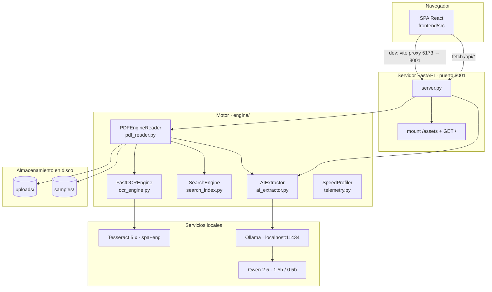
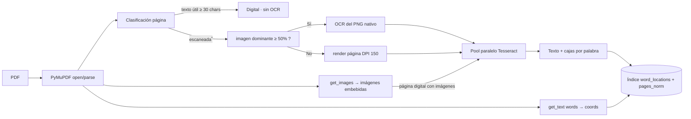
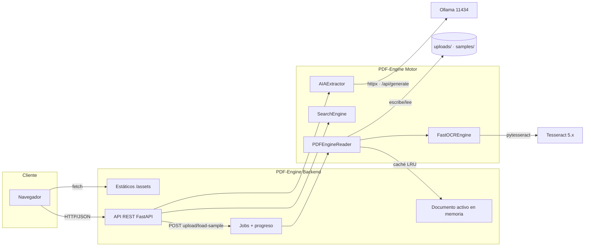

# Arquitectura del proyecto — PDF-Engine

> Documento complementario a [DOCUMENTACION_PROYECTO.md](DOCUMENTACION_PROYECTO.md).
> Toda la información de este documento fue extraída del estado real del repositorio.

---

## 1. Vista general

PDF-Engine es una aplicación **monolítica** formada por:

- Un **backend FastAPI** (Python 3.12) que actúa a la vez como **API REST** y como **servidor de estáticos** del frontend compilado.
- Un **frontend SPA** en React + Vite + Tailwind, compilado a `frontend/dist` y servido por el propio backend (en desarrollo, Vite corre con proxy hacia el backend).
- Un **núcleo de procesamiento** en Python (`engine/`) independiente de FastAPI y reutilizable.
- **Servicios externos locales:** Tesseract OCR (binario del sistema) y Ollama (servidor de modelos LLM).



---

## 2. Comunicación entre componentes

### 2.1 Navegador ↔ Backend

- En **producción**: FastAPI sirve `frontend/dist/index.html` en `GET /` y monta `/assets` como estáticos; el navegador llama rutas relativas `/api/*`.
- En **desarrollo**: Vite (puerto 5173) proxya `/api` → `http://localhost:8001` (vite.config.js:9-14).

Formato de intercambio: **JSON** para datos y **PNG** para vistas previas e imágenes.

### 2.2 Backend ↔ Motor

`server.py` instancia singletons (server.py:49-50):

```python
reader = PDFEngineReader()
ai_client = AIExtractor()
```

- `POST /api/upload` y `POST /api/load-sample` → `PDFEngineReader.process_pdf(...)` corriendo en hilo vía `asyncio.to_thread`.
- `POST /api/search` → `SearchEngine.search(active_document["data"], query)`.
- `POST /api/extract-ai` / `POST /api/ask` → `AIExtractor.extract_values(...)` / `AIExtractor.ask(...)`.
- `GET /api/page-preview` usa el `fitz.Document` abierto mantenido en `active_document["doc_fitz"]`.

### 2.3 Motor ↔ Tesseract

- `FastOCREngine.process_batch` distribuye `(image_bytes, image_id)` entre workers de `ProcessPoolExecutor`.
- Cada worker (`ocr_single_image_worker`) abre la imagen con Pillow, aplica `preprocess_image_antitodo` y llama `pytesseract.image_to_data` con `--oem 1 --psm 3 -l spa+eng`.
- Devuelve texto reconstruido en orden de lectura (bloque→párrafo→línea) y cajas por palabra en píxeles del tamaño original (conversión mediante escalas `sx`,`sy`).

### 2.4 Motor ↔ Ollama (IA)

- `AIExtractor` usa `httpx.AsyncClient`:
  - `GET /api/tags` para listar modelos (filtra por "qwen").
  - `POST /api/generate` para generar con `format: json`, `temperature 0.1`, `num_predict 400`, `keep_alive 10m`, timeout 300 s.
- Contexto: o bien contexto podado por puntuación de páginas (extracción de campos), o hasta 5 fragmentos de evidencia del buscador léxico (Q&A). El modelo nunca recibe el documento completo.

---

## 3. Flujo de construcción del índice de búsqueda



> **Nota de nodo:** una página se considera escaneada cuando su texto digital útil es inferior a `ACTIVE_TEXT_CHARS = 30` caracteres (pdf_reader.py:110). * (El nodo "escaneada" en el diagrama agrupa la condición real.)

---

## 4. Decisiones de arquitectura clave

| Decisión | Detalle | Evidencia |
| --- | --- | --- |
| OCR selectivo con deduplicación | Solo las páginas necesarias llegan a OCR; nunca se OCRiza dos veces el mismo contenido (página renderizada o imagen dominante, no ambos). | `pdf_reader.py:181-226`, `test_scanned_pdf_not_double_ocr` |
| Índice léxico con coordenadas | La búsqueda resuelve contra un índice de palabras en memoria construido en tiempo de procesamiento. | `pdf_reader.py:289-301` |
| Búsqueda exacto → difuso → frase | Sin base vectorial; fallbacks de `difflib` solo para términos sin aciertos exactos. | `search_index.py:6-9, 83-244` |
| Poda de contexto para IA | El modelo recibe ≤ 3500 caracteres del documento. | `ai_extractor.py:39-107` |
| Guardia anti-alucinación | Sin evidencia → `answer: null`, `confidence: 0`, sin invocar al LLM. | `ai_extractor.py:239-243, 272-274` |
| Caché por hash SHA-256 (LRU, 3 docs) | El proceso completo reutiliza resultados para el mismo archivo. | `pdf_reader.py:41-58` |
| Procesamiento asíncrono por jobs | Subida → job_id → polling de progreso → documento en el job. | `server.py:117-138` |
| Estado del documento en memoria | Un documento activo global (no multi-usuario). | `server.py:53` |

---

## 5. Límites de la arquitectura (verificados)

1. **Monousuario efectivo:** el documento activo es un estado global; dos clientes simultáneos interferirían.
2. **Sin persistencia:** caché y jobs son volátiles; los archivos quedan en disco sin limpieza.
3. **IA lenta en CPU:** el motor depende de Ollama local; en un equipo de 2 núcleos la extracción IA tarda minutos.
4. **Dependencias muertas:** `numpy` y `augly` están en `requirements.txt` pero no se usan.
5. **CORS abierto (`*`) + credenciales:** configuración de CORS deficiente para producción (server.py:23-29).

---

## 6. Componentes y sus responsabilidades

| Componente | Archivo | Responsabilidades principales |
| --- | --- | --- |
| `server.py` | server.py | API REST, jobs, validación, CORS, estáticos, estado del documento. |
| `PDFEngineReader` | engine/pdf_reader.py | Lectura digital, clasificación, OCR selectivo, construcción de índice, caché SHA-256, métricas. |
| `FastOCREngine` | engine/ocr_engine.py | Pool de procesos para OCR paralelo y preprocesado Anti-Todo. |
| `SearchEngine` | engine/search_index.py | Búsqueda léxica (exacta, normalizada, difusa, frase) y snippets. |
| `AIExtractor` | engine/ai_extractor.py | Poda de contexto, llamadas a Ollama, extracción de campos y Q&A. |
| `SpeedProfiler` | engine/telemetry.py | Medición de lapsos y resumen de rendimiento por documento. |
| Frontend (SPA) | frontend/src/** | Interfaz de usuario, estado, consumo de API, visor con resaltado. |
| `run.sh` | run.sh | Bootstrap del entorno: venv, dependencias, build frontend, chequeo de Ollama, arranque. |

---

## 7. Diagrama de componentes (C4-lite)

