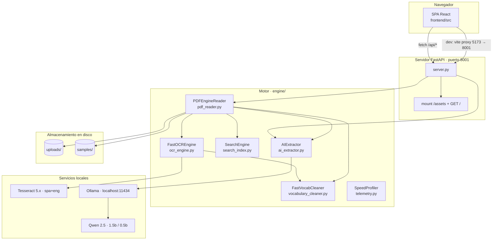
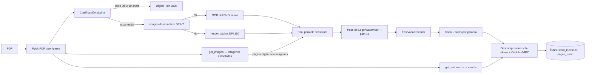
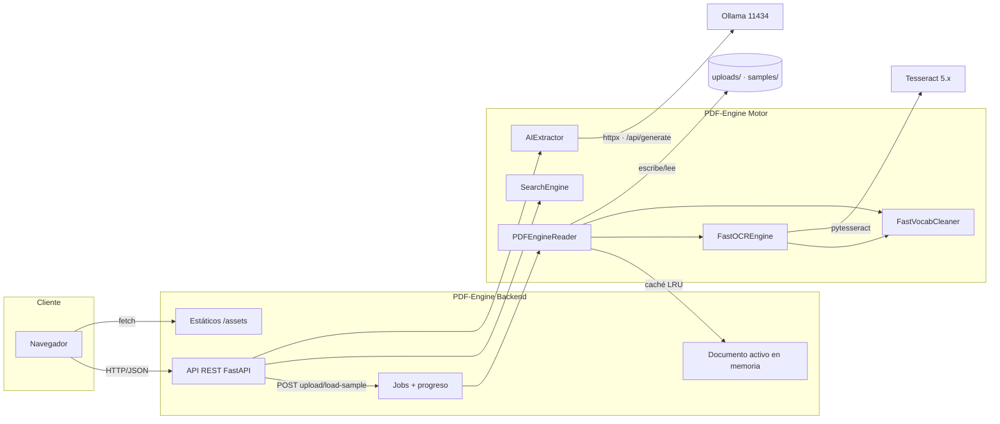

# Arquitectura del proyecto — PDF-Engine

> Documento complementario a [DOCUMENTACION_PROYECTO.md](DOCUMENTACION_PROYECTO.md).
> Toda la información de este documento fue extraída del estado real del repositorio.

---

## 1. Vista general

PDF-Engine es una aplicación **monolítica** formada por:

- Un **backend FastAPI** (Python 3.12) que actúa a la vez como **API REST** y como **servidor de estáticos** del frontend compilado.
- Un **frontend SPA** en React + Vite + Tailwind, compilado a `frontend/dist` y servido por el propio backend (en desarrollo, Vite corre con proxy hacia el backend).
- Un **núcleo de procesamiento** en Python (`engine/`) independiente de FastAPI y reutilizable.
- **Servicios externos locales:** Tesseract OCR (binario del sistema) y Ollama (servidor de modelos LLM).



---

## 2. Comunicación entre componentes

### 2.1 Navegador ↔ Backend

- En **producción**: FastAPI sirve `frontend/dist/index.html` en `GET /` y monta `/assets` como estáticos; el navegador llama rutas relativas `/api/*`.
- En **desarrollo**: Vite (puerto 5173) proxya `/api` → `http://localhost:8001` (vite.config.js:9-14).

Formato de intercambio: **JSON** para datos y **PNG** para vistas previas e imágenes.

### 2.2 Backend ↔ Motor

`server.py` instancia singletons (server.py:49-50):

```python
reader = PDFEngineReader()
ai_client = AIExtractor()
```

- `POST /api/upload` y `POST /api/load-sample` → `PDFEngineReader.process_pdf(...)` corriendo en hilo vía `asyncio.to_thread`.
- `POST /api/search` → `SearchEngine.search(active_document["data"], query)`.
- `POST /api/extract-ai` / `POST /api/ask` → `AIExtractor.extract_values(...)` / `AIExtractor.ask(...)`.
- `GET /api/page-preview` usa el `fitz.Document` abierto mantenido en `active_document["doc_fitz"]`.

### 2.3 Motor ↔ Tesseract y Preprocesado Anti-Todo

- `FastOCREngine.process_batch` distribuye `(image_bytes, image_id)` entre workers de `ProcessPoolExecutor`.
- Cada worker (`ocr_single_image_worker`) abre la imagen con Pillow y aplica `preprocess_image_antitodo`:
  - **Preservación de tickets estrechos**: solo escala hacia abajo páginas enormes (> 2000 px) si su ancho es ≥ 1000 px; nunca reduce recibos térmicos estrechos, preservando la resolución de fuentes de matriz de punto.
  - **Supresión de sombras de escáner**: recorta sombras de bordes al 0.8% de los márgenes.
  - **Autocontraste adaptativo y máscara de enfoque**: mejora la nitidez de trazos finos.
- **Pase de alta frecuencia para logos y marcas de agua**:
  - Si el encabezado superior (16% o hasta 380 px) contiene trazos tenues, calcula una estimación de fondo con desenfoque gaussiano y aplica sustracción local vectorial (`255 - (bg - gray) * 3.5`) usando NumPy.
  - Ejecuta Tesseract con `--psm 11` (sparse text) para capturar logotipos, marcas de agua y textos que la segmentación de página completa descartaría como gráficos aislados (ej. `Previsalud Semedical`).
  - Mapea las cajas de palabras detectadas a las coordenadas de la página y las integra al flujo principal.
- **Normalización léxica en OCR**: cada palabra se pasa por `FastVocabCleaner` para corregir artefactos recurrentes y normalizar mayúsculas/minúsculas.

### 2.4 Motor ↔ Limpiador de Vocabulario (FastVocabCleaner)

- `FastVocabCleaner` (`engine/vocabulary_cleaner.py`) mantiene diccionarios en memoria de dominios médico, farmacéutico, institucional, administrativo y financiero.
- Aplica reglas directas para sustituir lecturas ruidosas de OCR (ej. `somedia`/`comedical` ➔ `semedical`, `droclorotiazida` ➔ `hidroclorotiazida`, `sartan` ➔ `losartan`).
- Restituye formas visuales estándar (`DISPLAY_FORMS`) con acentos y mayúsculas adecuadas.

### 2.5 Motor ↔ Ollama (IA)

- `AIExtractor` usa `httpx.AsyncClient`:
  - `GET /api/tags` para listar modelos (filtra por "qwen").
  - `POST /api/generate` para generar con `format: json`, `temperature 0.1`, `num_predict 400`, `keep_alive 10m`, timeout 300 s.
- Contexto: o bien contexto podado por puntuación de páginas (extracción de campos), o hasta 5 fragmentos de evidencia del buscador léxico (Q&A). El modelo nunca recibe el documento completo.

---

## 3. Flujo de construcción del índice de búsqueda



> **Nota de nodo:** una página se considera escaneada cuando su texto digital útil es inferior a `ACTIVE_TEXT_CHARS = 30` caracteres (pdf_reader.py:110). * (El nodo "escaneada" en el diagrama agrupa la condición real.)

---

## 4. Decisiones de arquitectura clave

| Decisión | Detalle | Evidencia |
| --- | --- | --- |
| OCR selectivo con deduplicación | Solo las páginas necesarias llegan a OCR; nunca se OCRiza dos veces el mismo contenido (página renderizada o imagen dominante, no ambos). | `pdf_reader.py:181-226`, `test_scanned_pdf_not_double_ocr` |
| Detección de logos y marcas de agua | Sustracción de fondo local con NumPy y pase `--psm 11` en encabezados para recuperar textos con bajo contraste. | `ocr_engine.py:148-182` |
| Normalización léxica especializada | Corrección fonética y ortográfica mediante `FastVocabCleaner` con diccionarios de salud y facturación. | `vocabulary_cleaner.py` |
| Índice léxico con coordenadas y sub-tokens | La búsqueda resuelve contra un índice en memoria con coordenadas exactas; descompone códigos (`CO9CA0101-LOSARTÁN`) e indexa cédulas limpias sin puntos (`1043589150`). | `pdf_reader.py:131-139, 378-388` |
| Búsqueda multinivel exacto ➔ prefijo ➔ subcadena ➔ difuso | Sin base vectorial pesada; soporte de autocompletado y palabras incompletas (ej. "doc" ➔ "doctor") y fallback difuso `difflib`. | `search_index.py:83-244` |
| Poda de contexto para IA | El modelo recibe ≤ 3500 caracteres del documento. | `ai_extractor.py:39-107` |
| Guardia anti-alucinación | Sin evidencia → `answer: null`, `confidence: 0`, sin invocar al LLM. | `ai_extractor.py:239-243, 272-274` |
| Caché por hash SHA-256 (LRU, 3 docs) | El proceso completo reutiliza resultados para el mismo archivo. | `pdf_reader.py:41-58` |
| Procesamiento asíncrono por jobs | Subida → job_id → polling de progreso → documento en el job. | `server.py:117-138` |
| Estado del documento en memoria | Un documento activo global (no multi-usuario). | `server.py:53` |

---

## 5. Límites de la arquitectura (verificados)

1. **Monousuario efectivo:** el documento activo es un estado global; dos clientes simultáneos interferirían.
2. **Sin persistencia:** caché y jobs son volátiles; los archivos quedan en disco sin limpieza automática programada.
3. **IA lenta en CPU:** el motor depende de Ollama local; en un equipo de 2 núcleos la extracción IA tarda minutos (en GPU baja a segundos).
4. **Dependencia residual:** `augly` figura en `requirements.txt` pero no se importa en el runtime. `numpy` sí se utiliza activamente para álgebra de píxeles en `ocr_engine.py`.
5. **CORS abierto (`*`) + credenciales:** configuración de CORS permisiva adecuada para desarrollo pero que debe ajustarse en producción (server.py:23-29).

---

## 6. Componentes y sus responsabilidades

| Componente | Archivo | Responsabilidades principales |
| --- | --- | --- |
| `server.py` | server.py | API REST, jobs, validación, CORS, estáticos, estado del documento. |
| `PDFEngineReader` | engine/pdf_reader.py | Lectura digital, clasificación, OCR selectivo, descomposición de sub-tokens e IDs, construcción de índice, caché SHA-256, métricas. |
| `FastOCREngine` | engine/ocr_engine.py | Pool de procesos para OCR paralelo, preprocesado Anti-Todo y pase de alta frecuencia para logos/marcas de agua. |
| `FastVocabCleaner` | engine/vocabulary_cleaner.py | Corrección léxica, diccionarios de dominio y normalización de mayúsculas/minúsculas. |
| `SearchEngine` | engine/search_index.py | Búsqueda léxica multinivel (exacto, prefijo, subcadena, difuso, frase) y snippets con coordenadas. |
| `AIExtractor` | engine/ai_extractor.py | Poda de contexto, llamadas a Ollama, extracción de campos y Q&A con guardia anti-alucinación. |
| `SpeedProfiler` | engine/telemetry.py | Medición de lapsos y resumen de rendimiento por documento. |
| Frontend (SPA) | frontend/src/** | Interfaz de usuario, estado, consumo de API, visor con resaltado. |
| `run.sh` | run.sh | Bootstrap del entorno: venv, dependencias, build frontend, chequeo de Ollama, arranque. |

---

## 7. Diagrama de componentes (C4-lite)

