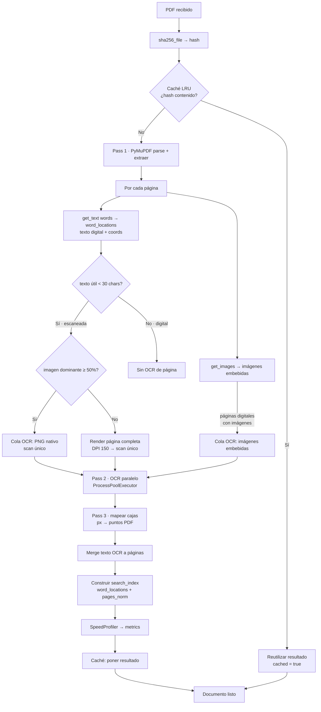
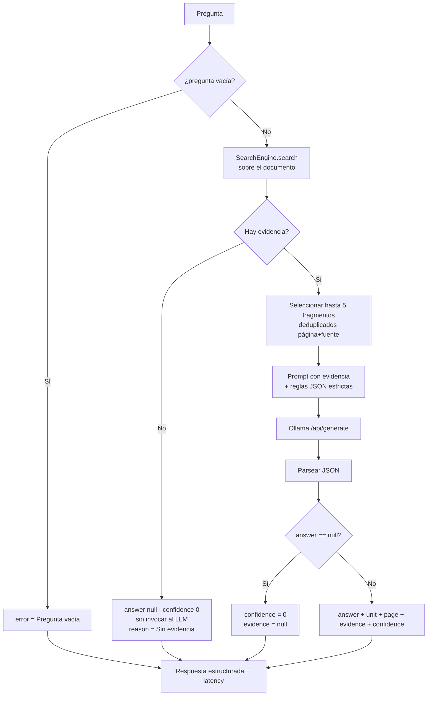
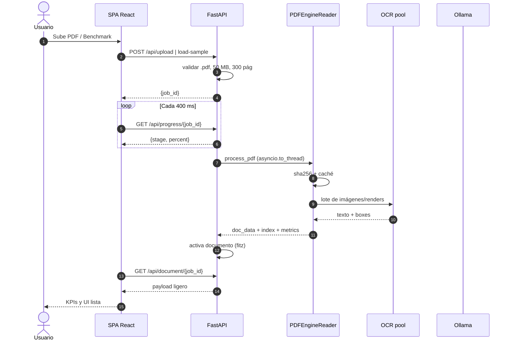
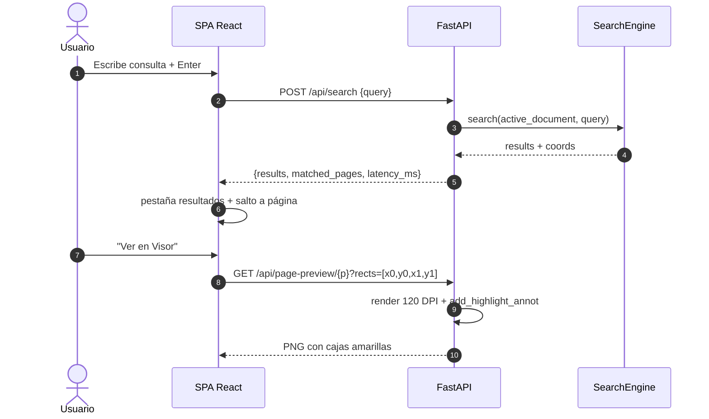
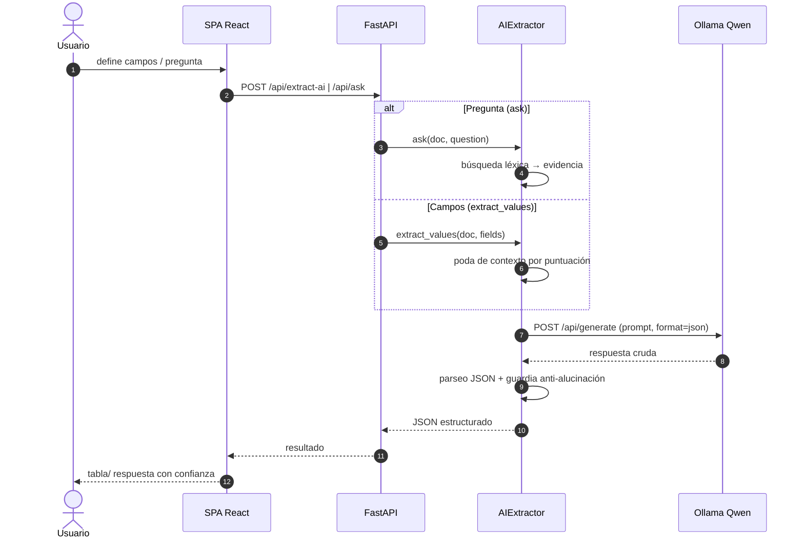
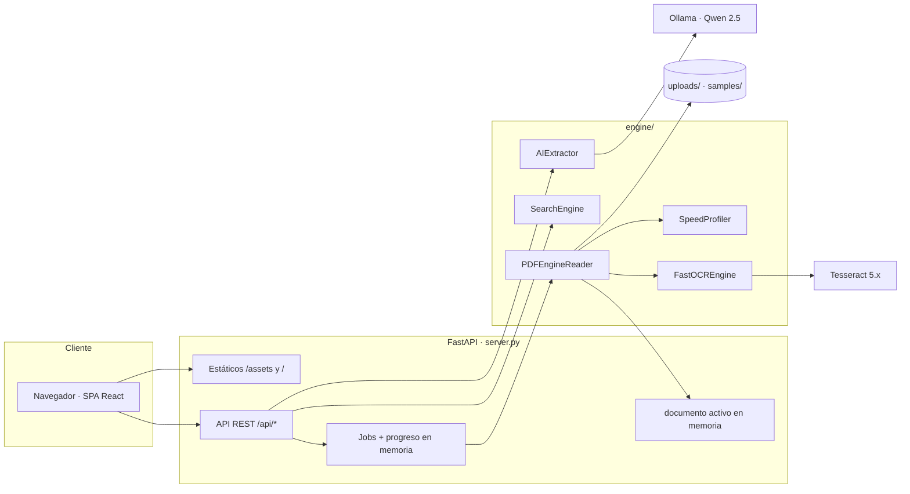
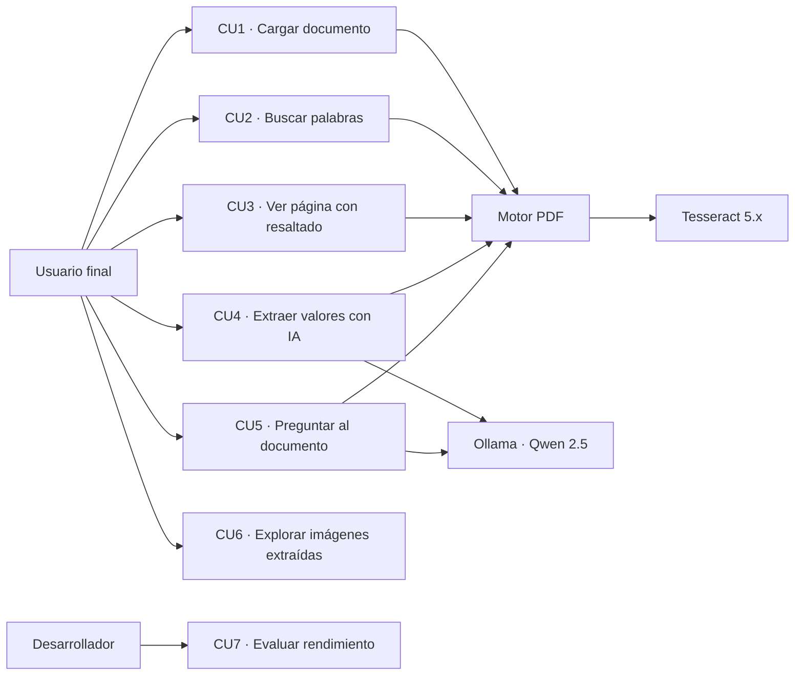

# Diagramas — PDF-Engine

> Documento complementario a [DOCUMENTACION_PROYECTO.md](DOCUMENTACION_PROYECTO.md).
> Cada diagrama representa exclusivamente componentes y flujos que existen en el código real.

---

## 1. Diagrama de arquitectura del sistema

```mermaid
flowchart TD
    U[Usuario / Navegador] -->|HTTP| F[Frontend React SPA<br/>servido por FastAPI]
    F -->|fetch /api/...| API[FastAPI server.py<br/>puerto 8001]

    API --> UP[POST /api/upload<br/>POST /api/load-sample]
    API --> PR[GET /api/progress/{job_id}]
    API --> DOC[GET /api/document/{job_id}]
    API --> SR[POST /api/search]
    API --> AI[POST /api/extract-ai<br/>POST /api/ask]
    API --> PV[GET /api/page-preview]
    API --> EI[GET /api/extracted-image]

    UP --> READER[PDFEngineReader<br/>engine/pdf_reader.py]
    READER -->|hash SHA-256| CACHE[Cache LRU en memoria<br/>3 documentos]
    READER -->|imágenes/render| OCR[FastOCREngine<br/>engine/ocr_engine.py]
    OCR --> TESS[Tesseract 5.x<br/>spa+eng · pool de workers]
    READER --> IDX[Índice léxico word → coords]
    IDX --> SR2[SearchEngine<br/>engine/search_index.py]

    AI --> EX[AIExtractor<br/>engine/ai_extractor.py]
    EX -->|contexto podado + prompt JSON| OLL[Ollama local :11434]
    OLL --> QWEN[Qwen 2.5<br/>1.5b / 0.5b]
    QWEN --> EX
    EX --> AI

    API --> DISK[(uploads/ · samples/)]
    READER --> DISK
```

---

## 2. Flujo de procesamiento de un documento (pipeline)

Pipeline real de `PDFEngineReader.process_pdf` (engine/pdf_reader.py:60-317):



---

## 3. Flujo de búsqueda (prioridad de coincidencia)

Orden real de coincidencia de `SearchEngine.search` (engine/search_index.py:83-244):

```mermaid
flowchart TB
    Q[Consulta del usuario] --> TOK[Tokenizar + normalizar]
    TOK --> EXACT{¿término en<br/>word_locations?}
    EXACT -->|Sí| R1[Resultados exactos<br/>match_type = exacto]
    EXACT -->|No| FZ{len ≥ 4?}
    FZ -->|No| SKIP[Sin diferidos]
    FZ -->|Sí| SEQ[Comparar con difflib<br/>por primera letra]
    SEQ --> TH{ratio ≥ 0.82}
    TH -->|Sí| R2[Resultados difusos<br/>top 5 candidatos × 10 ubicaciones]
    TH -->|No| SKIP2[Sin coincidencia difusa]
    TOK --> PHRASE{¿más de 1 token?}
    PHRASE -->|Sí| ALL{¿todos los tokens<br/>en página/fuente?}
    ALL -->|Sí| R3[Resultado por frase<br/>match_type = frase]
    ALL -->|No| SKIP3[Sin coincidencia de frase]
    R1 --> DEDUP[Deduplicar (página, fuente, término, coords)]
    R2 --> DEDUP
    R3 --> DEDUP
    DEDUP --> OUT[Results + matched_pages + search_latency_ms]
```

---

## 4. Flujo de extracción de valores con IA

Flujo real de `AIExtractor.extract_values` (engine/ai_extractor.py:152-198):

```mermaid
flowchart TB
    F[fields solicitados] --> EMPTY{¿campos vacíos?}
    EMPTY -->|Sí| R0[Respuesta vacía<br/>sin llamar al modelo]
    EMPTY -->|No| PRUNE[build_pruned_context<br/>poda de contexto ≤ 3500 chars]
    PRUNE --> N{≤ 3 páginas?}
    N -->|Sí| ALLT[Todo el texto<br/>encabezado --- PÁGINA N ---]
    N -->|No| SCORE[Puntuar páginas por aparición<br/>de campos +5 / palabras +1]
    SCORE --> TOP[Top 4 + página 1 garantizada]
    TOP --> ALLT
    ALLT --> PROMPT[Construir prompt JSON en español]
    PROMPT --> GEN[POST /api/generate<br/>format json · temp 0.1 · num_predict 400]
    GEN --> PARSE{¿JSON válido?}
    PARSE -->|Sí| OK[values extraídos]
    PARSE -->|No| CLEAN[Limpiar ```/extraer primer {...}]
    CLEAN --> PARSE2{¿JSON válido?}
    PARSE2 -->|Sí| OK
    PARSE2 -->|No| NF[Campos = No encontrado<br/>+ error reportado]
    OK --> OUT[values + pages_consulted + latency + model_used]
    NF --> OUT
```

---

## 5. Flujo de pregunta-respuesta (Q&A)

Flujo real de `AIExtractor.ask` (engine/ai_extractor.py:201-289):



---

## 6. Secuencia: carga de documento con progreso



---

## 7. Secuencia: búsqueda y resaltado en visor



---

## 8. Secuencia: extracción IA (poda de contexto)



---

## 9. Diagrama de componentes



---

## 10. Grafo de actores y casos de uso

Modelo de casos de uso representado como grafo (más fiel al código real que un diagrama UML clásico por clases, al carecer el proyecto de casos detallados normalizados):



> CU1–CU7 se describen en la sección 14 de [DOCUMENTACION_PROYECTO.md](DOCUMENTACION_PROYECTO.md) con precondiciones, flujos y alternativas. No existe caso de uso de autenticación porque no hay autenticación.

---

## 11. Ausencias intencionales de diagramas

| Diagrama | Motivo de ausencia |
| --- | --- |
| ERD / modelo de datos | El proyecto **no tiene base de datos** (no existen tablas ni colecciones). |
| Diagrama de C4 de despliegue | No hay despliegue multi-entorno (sin Docker, sin n8n, sin cloud) en el repositorio. |
| Diagrama de redes/RAG | No existe RAG vectorial ni embeddings; la recuperación es léxica. |