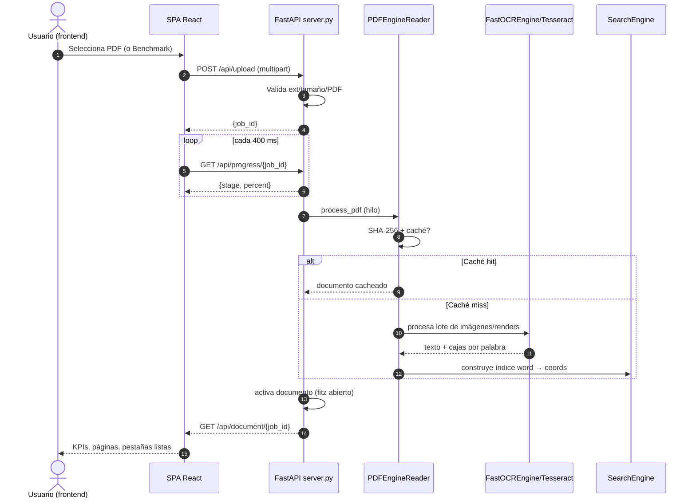
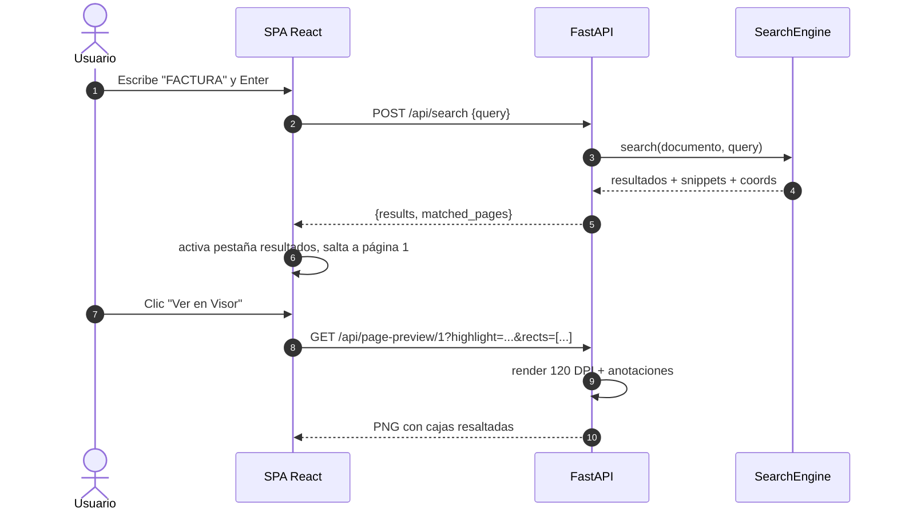
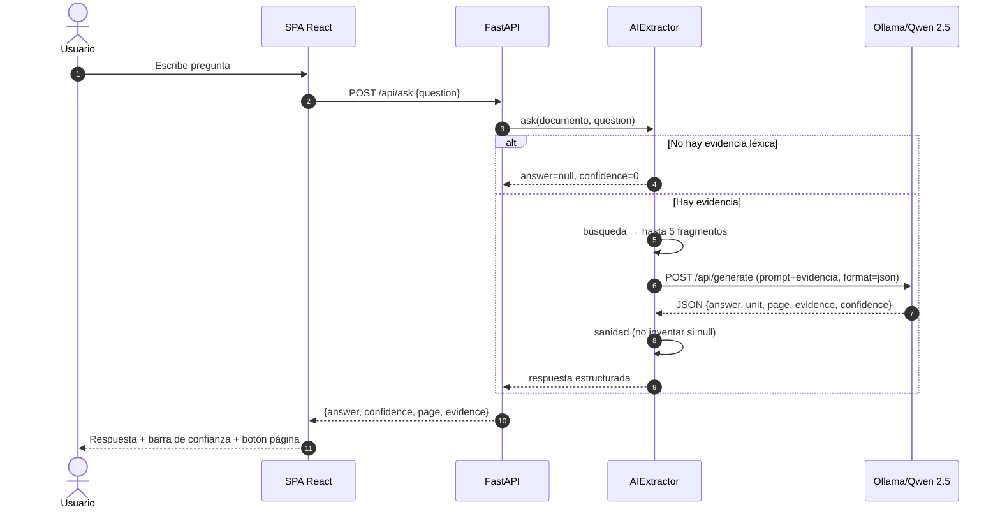

# DOCUMENTACIÓN DEL PROYECTO

**Proyecto:** PDF-Engine (PDF-Engine Enterprise)

**Versión del proyecto:** 2.0.0 (según `FastAPI(title="PDF-Engine Enterprise", version="2.0.0")`)

**Fecha de elaboración:** 24 de septiembre de 2026

**Alcance de la documentación:**

Esta documentación se generó a partir de una auditoría completa del repositorio **en su estado real actual**. Toda la información descrita fue verificada contra el código fuente, los archivos de configuración, las pruebas y la ejecución real de los componentes cuando fue posible.

Cuando una funcionalidad está **incompleta, experimental o solo planeada**, se indica explícitamente con uno de estos estados:

| Estado | Significado |
| --- | --- |
| **Implementado** | La funcionalidad existe y funciona en el código actual. |
| **Parcialmente implementado** | Existe pero tiene limitaciones o solo cubre parte del alcance. |
| **Pendiente** | Está planeada pero no existe en el código. |
| **Simulado** | Existe una maqueta o simulación, no el funcionamiento real. |
| **No implementado** | No existe en absoluto. |

---

## 1. Información general

### Nombre del proyecto

**PDF-Engine** (también referido como *PDF-Engine Enterprise* en el título de la aplicación FastAPI, en el comentario del `run.sh` y en el mensaje del commit `ae33964`).

### Descripción

Motor de procesamiento de documentos PDF con:

- **Lectura digital con PyMuPDF** (extremo C): extrae texto y coordenadas por palabra en milisegundos.
- **OCR inteligente "solo donde hace falta"** con Tesseract 5.x: las páginas con texto digital suficiente no se mandan a OCR; las páginas escaneadas se procesan con deduplicación (nunca se hace doble OCR del mismo contenido) y un pool paralelo de workers con preprocesado "Anti-Todo".
- **Pase de alta frecuencia para logos y marcas de agua**: sustracción de fondo local con NumPy y pase `--psm 11` que recupera encabezados tenues, fuentes de matriz de punto o marcas de agua que el segmentador descarta como gráficos aislados.
- **Normalización léxica especializada (`FastVocabCleaner`)**: diccionario para términos médicos, farmacéuticos, institucionales y financieros; corrección de artefactos de OCR y restitución de mayúsculas/minúsculas y tildes.
- **Índice de búsqueda léxico multinivel preconstruido**: `palabra → {página, fuente, coordenadas x0/y0/x1/y1}` para texto digital, OCR de páginas escaneadas y OCR de imágenes embebidas. Soporta búsqueda exacta, por prefijo (palabras incompletas / predictivo), por subcadena, difusa (difflib ≥ 82%) y por frase, además de descomponer tokens compuestos (`CO9CA0101-LOSARTÁN`) e indexar números de identificación sin puntos (`1.043.589.150` ➔ `1043589150`) y códigos MRZ.
- **Extracción de datos con IA local (Qwen 2.5 vía Ollama)**: extracción de campos con JSON estructurado y respuestas a preguntas con evidencia citada, página y nivel de confianza.
- **Procesamiento por jobs con progreso en vivo** y **caché por SHA-256** de los últimos N documentos (LRU).

### Problema identificado

Los documentos PDF representan un desafío de procesamiento porque contienen información en tres formas distintas: texto digital (extraíble directamente), imágenes embebidas con contenido textual y páginas escaneadas (imágenes de página completa). El procesamiento genérico de estos documentos suele:

- Hacer OCR **incondicional** de todas las páginas, duplicando trabajo y consumiendo tiempo y CPU.
- Perder las **coordenadas de las palabras**, impidiendo resaltar coincidencias en la página.
- Permitir la búsqueda solo sobre texto digital u OCR, pero no sobre ambos de forma unificada.
- Perder texto tenue, sellos, marcas de agua y encabezados con poco contraste que los motores de OCR descartan como gráficos o ruido.
- Fracasar en búsquedas de códigos compuestos o cédulas con puntos si el usuario busca el número continuo.
- Depender de herramientas de visión pesadas (LLaVA/torch) o de servicios externos en la nube para la extracción de datos, con requisitos de hardware o conectividad elevados.

### Justificación

Puede justificarse a partir de la decisión explícita registrada en el `README.md` y en los archivos de código:

- El motor prioriza **velocidad y bajo consumo de recursos**: sin modelos pesados de visión (LLaVA/torch) en el runtime. Preprocesamiento ágil mediante Pillow y álgebra vectorial con NumPy.
- La búsqueda y la extracción de datos con IA se resuelven con **modelos locales** (Ollama + Qwen 2.5), manteniendo los datos en la máquina, sin depender de servicios externos pagos.
- El sistema combina un **motor lexicográfico** (rápido, determinista, con coordenadas) con un **modelo de lenguaje** (comprensión y extracción estructurada), de modo que el modelo solo recibe contexto podado y relevante.

### Objetivo general

Construir un motor de procesamiento de PDFs que unifique extracción de texto digital, OCR de escaneos e imágenes, detección de sellos/marcas de agua, búsqueda léxica multinivel con coordenadas y extracción de datos con IA local, de forma rápida, sin dependencias de visión pesadas y ejecutable en una máquina doméstica con CPU modesta.

### Objetivos específicos

Los siguientes objetivos se derivan de las características declaradas en el `README.md` y verificadas en el código:

1. Leer texto digital y coordenadas por palabra mediante PyMuPDF.
2. OCR paralelo únicamente sobre contenido que lo requiera (páginas escaneadas e imágenes), con deduplicación para evitar trabajo doble.
3. Detectar tipografías tenues, sellos y marcas de agua mediante sustracción de fondo local y `--psm 11`.
4. Limpiar y normalizar el texto OCR mediante diccionarios especializados (`FastVocabCleaner`).
5. Construir un índice de búsqueda léxico con coordenadas espaciales, sub-tokens e identificadores normalizados.
6. Buscar con soporte multinivel: exacto, prefijo (palabras incompletas), subcadena, difuso y frase.
7. Extraer campos estructurados de un documento con un modelo de lenguaje local (Qwen 2.5).
8. Responder preguntas sobre el documento con evidencia citada y nivel de confianza, sin inventar respuestas.
9. Exponer una interfaz web (React + Vite + Tailwind) que permita subir documentos, ver progreso, navegar páginas con resaltado y visualizar resultados.

### Alcance

El alcance real del proyecto (lo que existe en el repositorio) es:

- Procesamiento de un documento PDF activo a la vez (estado en memoria del servidor).
- OCR de páginas escaneadas e imágenes embebidas con Tesseract (idiomas español e inglés).
- Búsqueda léxica exacta → normalizada → difusa sobre un índice preconstruido.
- Extracción de campos con IA y preguntas/respuestas con evidencia.
- Visualización de páginas como PNG con cajas de resaltado.
- Galería de imágenes extraídas con su texto OCR.
- Benchmarks y conjunto de pruebas automatizadas.

Fuera del alcance actual (no existe en el repositorio): persistencia en base de datos relacional o vectorial, autenticación de usuarios, integraciones externas (n8n, Telegram, webhooks), despliegue por contenedores (Docker) y despliegue en la nube.

### Limitaciones

Se documentan detalladamente en la sección [18. Limitaciones y trabajo futuro](#18-limitaciones-y-trabajo-futuro). Resumen de las principales:

- Rendimiento de la IA en CPU: el modelo Qwen local emite pocos tokens por segundo en equipos modestos; una extracción puede tardar 1–4 minutos.
- Solo un documento activo a la vez; los documentos procesados se mantienen en memoria/caché LRU.
- Sin autenticación ni autorización (acceso abierto a la API).
- CORS configurado con origen wildcard `*`.
- Dependencias declaradas pero sin uso: `numpy` y `augly` figuran en `requirements.txt` pero no son importadas en ningún módulo.

### Usuarios objetivo

El repositorio no contiene documentación explícita sobre usuarios objetivo. A partir de las características (facturas, reportes financieros, contratos, documentos corporativos de ejemplo en el benchmark) se puede inferir que el público objetivo son **equipos de procesamiento documental, contabilidad y auditoría** que necesitan indexar y extraer datos de PDFs digitales y escaneados.

> **Nota de fuentes:** los documentos de ejemplo del benchmark (`test_benchmark.py`) usan facturación, proveedores, NIT, presupuestos y actas de entrega, lo que respalda esa inferencia. No existe otra fuente en el repositorio sobre usuarios.

---

## 2. Requerimientos

### 2.1 Requerimientos funcionales

Los siguientes requerimientos funcionales se derivan **exclusivamente** de funcionalidades que existen y funcionan en el repositorio. Su estado fue verificado con pruebas autómatizadas y, en varios casos, con ejecución real.

| RF-01 | **Lectura de texto digital con coordenadas** |
| --- | --- |
| **Nombre** | Lectura de texto digital |
| **Descripción** | Extraer el texto digital de un PDF y registrar la posición (x0, y0, x1, y1) de cada palabra mediante `page.get_text("words", sort=True)` de PyMuPDF. |
| **Actor** | Usuario final (a través de la API o de la interfaz web). |
| **Entrada** | Archivo PDF con capa de texto digital. |
| **Proceso** | `PDFEngineReader.process_pdf()` (engine/pdf_reader.py:104-130): recorrido de páginas, extracción de palabras y normalización; las palabras con menos de 2 caracteres se descartan. |
| **Resultado esperado** | Páginas marcadas como `is_scanned: false` con su texto extraído y un índice `word_locations`. |
| **Estado** | **Implementado** (verificado por `test_valid_digital_pdf`, `test_digital_pages_not_ocr_rendered`). |

| RF-02 | **Detección de páginas escaneadas** |
| --- | --- |
| **Nombre** | Detección de páginas escaneadas |
| **Descripción** | Clasificar una página como escaneada cuando tiene menos de `ACTIVE_TEXT_CHARS = 30` caracteres útiles de texto. |
| **Actor** | Sistema (procesamiento). |
| **Entrada** | Página del PDF. |
| **Proceso** | `pdf_reader.py:110` (`is_scanned = char_count < self.ACTIVE_TEXT_CHARS`). |
| **Resultado esperado** | Páginas marcadas `is_scanned: true`. |
| **Estado** | **Implementado** (verificado en `test_scanned_pdf_not_double_ocr`). |

| RF-03 | **OCR paralelo con deduplicación** |
| --- | --- |
| **Nombre** | OCR inteligente sin doble trabajo |
| **Descripción** | Si la página escaneada contiene una imagen dominante (cobertura ≥ 50 %), hacer OCR de esa imagen a resolución nativa; de lo contrario, renderizar la página completa a DPI configurado. Nunca OCR de página + imagen duplicados. |
| **Actor** | Sistema (procesamiento). |
| **Entrada** | Imágenes embebidas o renders de página (PNG). |
| **Proceso** | `pdf_reader.py:181-226` + `FastOCREngine.process_batch()` (engine/ocr_engine.py:144-174) con `ProcessPoolExecutor`. |
| **Resultado esperado** | Un ítem OCR por página escaneada (deduplicado), con texto y cajas por palabra. |
| **Estado** | **Implementado** (verificado por `test_scanned_pdf_not_double_ocr`: 2 páginas → 2 ítems OCR). |

| RF-04 | **Preprocesado "Anti-Todo" y Pase de Logos/Marcas de Agua** |
| --- | --- |
| **Nombre** | Preprocesado adaptativo Anti-Todo y Detección de Logos |
| **Descripción** | Escalado condicional con regla de preservación de tickets estrechos (solo escala hacia abajo si > 2000 px y ancho ≥ 1000 px, protegiendo fuentes de matriz de punto), supresión de sombras de escáner al 0.8% de los bordes, autocontraste adaptativo y máscara de enfoque. Adicionalmente, incluye un pase de alta frecuencia en encabezados con sustracción de fondo gaussiana (`diff = 255 - (bg - gray) * 3.5` con NumPy) y `--psm 11` para recuperar logos tenues, marcas de agua y textos punteados que la segmentación de página completa descartaría. |
| **Actor** | Sistema (procesamiento). |
| **Entrada** | Imagen PIL. |
| **Proceso** | `preprocess_image_antitodo()` y pase de encabezado en `ocr_single_image_worker()` (ocr_engine.py:16-182). |
| **Resultado esperado** | Imagen procesada, factores de escala y extracción de texto de logotipos/marcas de agua con cajas de palabras recuperadas. |
| **Estado** | **Implementado** (verificado por `test_preprocess_returns_scales`, `test_preprocess_downscales_huge_image`, `test_preprocess_upscales_small_image`, pruebas con tickets y documentos con logotipos). |

| RF-05 | **Índice de búsqueda preconstruido con coordenadas y sub-tokens** |
| --- | --- |
| **Nombre** | Índice léxico palabra → coordenadas y descomposición |
| **Descripción** | Registrar cada palabra (digital u OCR) en `word_locations: palabra normalizada → [{página, fuente, coordenadas}]`. Descompone automáticamente cadenas delimitadas (`CO9CA0101-LOSARTÁN`) para indexar tanto el identificador completo como cada sub-token (`losartan`, `co9ca0101`). Además, extrae e indexa números limpios sin puntuación a partir de identificadores con puntos (`1.043.589.150` ➔ `1043589150`, `32.848.952` ➔ `32848952`) y secuencias de 6–12 dígitos en líneas de códigos de barras / MRZ. |
| **Actor** | Sistema (procesamiento). |
| **Entrada** | Páginas procesadas (texto + OCR). |
| **Proceso** | `pdf_reader.py:128-139, 294-305` y `_register_ocr_boxes()` (pdf_reader.py:365-388). |
| **Resultado esperado** | Diccionario `search_index` con `word_locations` (incluyendo sub-tokens y números limpios con sus cajas exactas en puntos de página) y `pages_norm`. |
| **Estado** | **Implementado**. |

| RF-06 | **Búsqueda multinivel (exacto ➔ prefijo ➔ subcadena ➔ difuso ➔ frase)** |
| --- | --- |
| **Nombre** | Búsqueda léxica jerárquica con autocompletado y fallbacks |
| **Descripción** | Dado un texto de consulta, la búsqueda evalúa en orden jerárquico: (1) coincidencia exacta sobre el índice y correcciones léxicas; (2) coincidencia por prefijo / autocompletado para palabras incompletas (ej. `"doc"` ➔ `"doctor"`, `"losart"` ➔ `"losartán"`); (3) coincidencia de subcadena interna para términos de longitud ≥ 3; (4) coincidencia difusa con `difflib` para términos sin hits previos (longitud ≥ 4, similitud ≥ 0.82); (5) coincidencia por frase (todos los términos contiguos en la misma página/fuente). Devuelve fragmento (snippet), página, fuente, tipo de coincidencia y coordenadas espaciales `[x0, y0, x1, y1]`. |
| **Actor** | Usuario final. |
| **Entrada** | Consulta de texto. |
| **Proceso** | `SearchEngine.search()` (engine/search_index.py:83-244). |
| **Resultado esperado** | Lista `results` con `match_type` (`exacto` / `prefijo` / `subcadena` / `difuso` / `frase`), snippets y coordenadas, más `matched_pages` y latencia en ms. |
| **Estado** | **Implementado** (verificado por suite de pruebas y consultas en vivo). |

| RF-06B | **Limpieza y normalización de vocabulario especializado (`FastVocabCleaner`)** |
| --- | --- |
| **Nombre** | Corrector y normalizador de vocabulario especializado |
| **Descripción** | Mantener un catálogo de términos en dominios de salud (medicamentos, dosis, procedimientos), institucional, financiero y administrativo. Corregir errores fonéticos y ortográficos frecuentes producidos por OCR (ej. `somedia`/`comedical` ➔ `semedical`, `droclorotiazida` ➔ `hidroclorotiazida`, `sartan` ➔ `losartan`), y restituir la forma visual con mayúsculas/minúsculas y tildes originales. |
| **Actor** | Sistema (procesamiento y búsqueda). |
| **Entrada** | Palabras extraídas por OCR o términos de consulta. |
| **Proceso** | `FastVocabCleaner.correct_word()` y diccionarios de `engine/vocabulary_cleaner.py`. |
| **Resultado esperado** | Términos limpios, normalizados y asociados al índice espacial. |
| **Estado** | **Implementado** (verificado por `tests/test_vocab_cleaner.py`). |

| RF-07 | **Caché de documentos por SHA-256 (LRU)** |
| --- | --- |
| **Nombre** | Caché LRU de procesamiento |
| **Descripción** | Escribir/leer la salida del procesamiento usando el hash SHA-256 del archivo como clave, manteniendo a lo sumo `cache_size` documentos (default 3), con política LRU. |
| **Actor** | Sistema (procesamiento). |
| **Entrada** | Archivo PDF. |
| **Proceso** | `sha256_file()` (pdf_reader.py:15-24) y `_cache_get/_cache_put` (pdf_reader.py:47-58). |
| **Resultado esperado** | Segunda llamada con el mismo archivo devuelve el resultado cacheado (marca `cached: true`). |
| **Estado** | **Implementado** (verificado por `test_cache_hit_and_miss`, `test_cache_miss_for_different_file`). |

| RF-08 | **Procesamiento por jobs con progreso** |
| --- | --- |
| **Nombre** | Jobs asíncronos con poll de progreso |
| **Descripción** | Las subidas se registran como jobs `{job_id, status, progress}`; el cliente hace polling de `GET /api/progress/{job_id}` y recibe la etapa (parsing/ocr/indexing/finalizing/done) y el porcentaje. |
| **Actor** | Usuario final (vía frontend). |
| **Entrada** | `POST /api/upload` o `POST /api/load-sample`. |
| **Proceso** | `_setup_job()` (server.py:117-138) ejecuta el procesamiento en un hilo (`asyncio.to_thread`) y actualiza el diccionario `jobs`. |
| **Resultado esperado** | El job pasa a `done` y `GET /api/document/{job_id}` devuelve el documento procesado. |
| **Estado** | **Implementado** (verificado con ejecución real del flujo completo en la auditoría). |

| RF-09 | **Extracción de valores con IA (Qwen 2.5)** |
| --- | --- |
| **Nombre** | Extracción estructurada de campos con IA local |
| **Descripción** | Seleccionar las páginas/snippets relevantes (poda de contexto ≤ 3500 chars) y pedir a Qwen 2.5 que extraiga los campos solicitados como JSON. |
| **Actor** | Usuario final. |
| **Entrada** | Lista de campos (ej. "Número de Factura", "Proveedor Autorizado"). |
| **Proceso** | `build_pruned_context()` + `extract_values()` (engine/ai_extractor.py:39-198). |
| **Resultado esperado** | Diccionario `values` con los campos solicitados, páginas consultadas, latencia y error opcional. |
| **Estado** | **Implementado**. La lógica está probada con Ollama simulado (mocking); la llamada real a Ollama fue ejercitada durante la auditoría (confirmando que responde, aunque con alta latencia en CPU). |

| RF-10 | **Preguntas y respuestas con evidencia** |
| --- | --- |
| **Nombre** | Q&A sobre el documento con evidencia citada |
| **Descripción** | Resolver una pregunta con el buscador léxico (hasta 5 fragmentos de evidencia) y que Qwen devuelva `{answer, unit, page, evidence, confidence}`. Si no hay evidencia, la respuesta es `null` con confianza 0 (no inventa). |
| **Actor** | Usuario final. |
| **Entrada** | Pregunta en lenguaje natural. |
| **Proceso** | `ask()` (engine/ai_extractor.py:201-289). |
| **Resultado esperado** | Respuesta estructurada con evidencia y página, o nulos con confianza 0. |
| **Estado** | **Implementado** (verificado por `test_ask_with_evidence_structured`, `test_ask_without_evidence_no_invention`, `test_ask_invalid_json`). |

| RF-11 | **Vista previa de página con resaltado** |
| --- | --- |
| **Nombre** | Visor de páginas con cajas de resaltado |
| **Descripción** | Renderizar una página a 120 DPI como PNG, aplicando anotaciones de resaltado amarillo proporcionadas por cajas `rects` explícitas o por búsqueda de texto `highlight` en la capa de texto digital. |
| **Actor** | Usuario final. |
| **Entrada** | Número de página (+ `rects` o `highlight`). |
| **Proceso** | `get_page_preview()` (server.py:282-338). |
| **Resultado esperado** | PNG de la página con las cajas resaltadas. |
| **Estado** | **Implementado** (verificado con ejecución real). |

| RF-12 | **Servir imágenes extraídas del PDF** |
| --- | --- |
| **Nombre** | Galería de imágenes embebidas |
| **Descripción** | Servir los bytes originales de las imágenes embebidas extraídas durante el procesamiento. |
| **Actor** | Usuario final. |
| **Entrada** | `image_id` (ej. `p13_img1`). |
| **Proceso** | `get_extracted_image()` (server.py:341-354). |
| **Resultado esperado** | Imagen con su tipo MIME correspondiente. |
| **Estado** | **Implementado** (verificado con ejecución real). |

| RF-13 | **Carga de documento de ejemplo (benchmark de 20 páginas)** |
| --- | --- |
| **Nombre** | Documento de muestra autogenerado |
| **Descripción** | Generar (si no existe) `samples/benchmark_20_pages.pdf` con 12 páginas digitales, 4 con imágenes embebidas y 4 escaneos ruidosos, y procesarlo. |
| **Actor** | Usuario final. |
| **Entrada** | `POST /api/load-sample` (sin cuerpo). |
| **Proceso** | `build_20_page_benchmark_pdf()` (test_benchmark.py:66-133) y `load_sample_benchmark()` (server.py:213-221). |
| **Resultado esperado** | `{job_id}` de un job de 20 páginas. |
| **Estado** | **Implementado** (verificado con ejecución real). |

| RF-14 | **Interfaz web: carga, progreso, navegación y resultados** |
| --- | --- |
| **Nombre** | Interfaz web React |
| **Descripción** | SPA en React que permite: subir PDF o cargar el benchmark, ver el progreso por etapas, navegar páginas, resaltar resultados, buscar, extraer valores con IA y consultar preguntas. |
| **Actor** | Usuario final. |
| **Entrada** | Archivo PDF del usuario o clic en "Benchmark". |
| **Proceso** | `frontend/src/App.jsx` orquesta el estado y el polling; componentes bajo `frontend/src/components/`. |
| **Resultado esperado** | Interfaz funcional: KPIs, buscador, navegador de páginas y 4 pestañas (Extracción IA, Visor, Búsqueda, Imágenes & OCR). |
| **Estado** | **Implementado** (build de producción exitoso, lint sin errores, 6 advertencias). |

### 2.2 Requerimientos no funcionales

Solo se documentan los que pueden justificarse por evidencia del proyecto (código, `README.md` o mediciones reales de la auditoría). **No** se inventan valores numéricos de rendimiento.

| Categoría | Descripción evidenciada |
| --- | --- |
| **Rendimiento** | El `README.md` documenta mediciones reales en hardware de desarrollo (CPU 2 núcleos, Tesseract 5.3.4, Qwen `0.5b`): ~12.3 s en procesar un PDF de 20 páginas (12 digitales + 4 con imagen + 4 escaneos ruidosos), ~3 ms por búsqueda, ~270 s de extracción IA de 5 campos. En la auditoría se reprodujo la lectura/OCR del mismo PDF de 20 páginas en 12.33 s (8 ítems OCR: 4 imágenes embebidas + 4 escaneos ruidosos), con 1.62 páginas/s. |
| **Seguridad** | Validación de extensión, tamaño máximo (50 MB) y número de páginas (300) en subidas; uso de `uuid` en nombres de archivo; lectura por chunks. Sin autenticación, sin cifrado de datos en reposo, CORS abierto (ver sección [11. Seguridad](#11-seguridad)). |
| **Disponibilidad** | El servicio expone estado de sistema (`/api/system-status`) y responde fallos de forma estructurada (`detail`). Sin tolerancia a fallos, HA ni reinicios automáticos documentados. |
| **Mantenibilidad** | Arquitectura modular clara (`engine/` con responsabilidades separadas: lector, OCR, búsqueda, IA, telemetría). Documentación en `README.md`. Comentarios en español en el código. |
| **Escalabilidad** | OCR paralelo con `ProcessPoolExecutor` (número de workers configurable). Sin escala horizontal (estado en memoria, un documento activo). |
| **Usabilidad** | Interfaz en español, modo claro/oscuro, indicadores de progreso, mensajes de "no encontrado" amigables, exportación de resultados (JSON/CSV). |
| **Compatibilidad** | Python 3.12+ (probado con 3.12.3), Node 18+ (probado con 22.23.3), Tesseract 5.x (secciones `spa`, `eng`, `osd` instaladas), Ollama con modelos Qwen. Frontend JSX (sin TypeScript), React 19, Vite 8, Tailwind 3. |

---

## 3. Arquitectura del sistema

La arquitectura es **monolítica de dos capas de presentación** con un **núcleo de procesamiento modular**:

- Un backend **FastAPI** (Python 3.12) que entrega el frontend compilado (estático) y expone una API REST.
- Un frontend **React + Vite + Tailwind** compilado a archivos estáticos servidos por el propio backend (y con proxy en desarrollo).
- Un núcleo de motor Python en `engine/` con módulos separados por responsabilidad:
  - `pdf_reader.py` (lectura, clasificación de páginas, caché, construcción del índice).
  - `ocr_engine.py` (OCR paralelo y preprocesado de imágenes).
  - `search_index.py` (búsqueda léxica).
  - `ai_extractor.py` (integración con Ollama / Qwen 2.5).
  - `telemetry.py` (medición de tiempos).
- **Sin base de datos clásica**: los datos viven en memoria (documento activo + caché LRU + diccionario de jobs).
- **IA local**: Ollama corriendo en `localhost:11434` con el modelo `qwen2.5:1.5b` (default) o `qwen2.5:0.5b`.

```mermaid
flowchart TD
    U[Usuario / Navegador] -->|HTTP| F[Frontend React SPA<br/>servido por FastAPI]
    F -->|fetch /api/...| API[FastAPI server.py<br/>puerto 8001]

    API --> UP[POST /api/upload<br/>POST /api/load-sample]
    API --> PR[GET /api/progress/{job_id}]
    API --> DOC[GET /api/document/{job_id}]
    API --> SR[POST /api/search]
    API --> AI[POST /api/extract-ai<br/>POST /api/ask]
    API --> PV[GET /api/page-preview]
    API --> EI[GET /api/extracted-image]

    UP --> READER[PDFEngineReader<br/>engine/pdf_reader.py]
    READER -->|hash SHA-256| CACHE[Cache LRU en memoria<br/>3 documentos]
    READER -->|imágenes/render| OCR[FastOCREngine<br/>engine/ocr_engine.py]
    OCR --> TESS[Tesseract 5.x<br/>spa+eng · pool de workers]
    READER --> IDX[Índice léxico word → coords]
    IDX --> SR2[SearchEngine<br/>engine/search_index.py]

    AI --> EX[AIExtractor<br/>engine/ai_extractor.py]
    EX -->|contexto podado + prompt JSON| OLL[Ollama local :11434]
    OLL --> QWEN[Qwen 2.5<br/>1.5b / 0.5b]
    QWEN --> EX
    EX --> AI

    API --> DISK[(uploads/ · samples/)]
    READER --> DISK
```

### Comunicación entre componentes

1. **Navegador ↔ Backend**: HTTP/JSON sobre la API REST + PNG para vistas previas e imágenes.
2. **Backend ↔ Motor**: `server.py` orquesta `PDFEngineReader`, `SearchEngine` y `AIExtractor` como singletons.
3. **Motor ↔ OCR**: `PDFEngineReader` entrega bytes de imágenes o renders y `FastOCREngine` los distribuye en un pool de procesos (`ProcessPoolExecutor`) que ejecutan `tesseract` vía `pytesseract`.
4. **Motor ↔ IA**: `AIExtractor` llama a la API HTTP de Ollama (`/api/tags`, `/api/generate`) con `httpx.AsyncClient`.
5. **Frontend ↔ Backend**: la SPA consulta `system-status` al cargar, sube archivos con `FormData`, hace polling de progreso cada 400 ms y ejecuta las operaciones de búsqueda y IA.

Los detalles se amplían en [docs/ARQUITECTURA.md](ARQUITECTURA.md).

---

## 4. Tecnologías utilizadas

Solo se listan tecnologías **realmente presentes y usadas** en el repositorio. Las versiones corresponden a las resueltas e instaladas durante la auditoría (verificación con `uv pip list` y `npm`, y ejecución real).

| Tecnología | Versión | Uso |
| --- | --- | --- |
| Python | 3.12.3 | Lenguaje del backend y del motor. |
| FastAPI | 0.141.1 | Framework REST del backend (`server.py`). |
| Uvicorn | 0.53.0 | Servidor ASGI para la aplicación FastAPI. |
| PyMuPDF (fitz) | 1.28.2 | Lectura del PDF a nivel C: texto, coordenadas de palabras, imágenes, render de páginas. |
| Pydantic | 2.13.5 | Modelos de validación de peticiones (`SearchRequest`, `AIRequest`, `AskRequest`). |
| Pillow (PIL) | 12.3.0 | Preprocesado "Anti-Todo" de imágenes antes del OCR. |
| NumPy | 2.5.3 | Operaciones vectoriales de filtrado espacial y sustracción de fondo local para detección de marcas de agua y logos en encabezados (`engine/ocr_engine.py`). |
| pytesseract | 0.3.13 | Wrapper para Tesseract OCR. |
| Tesseract OCR | 5.3.4 | Motor OCR del sistema (idiomas `spa`, `eng`, `osd`). |
| httpx | 0.28.1 | Cliente HTTP asíncrono para comunicarse con Ollama. |
| python-multipart | 0.0.32 | Parseo de subidas multipart en FastAPI. |
| Ollama | — (servicio local) | Servidor de modelos LLM local en `http://localhost:11434`. |
| Qwen 2.5 (`qwen2.5:1.5b`, `qwen2.5:0.5b`) | modelos GGUF vía Ollama | Extracción de datos y preguntas/respuestas. |
| React | 19.2.8 | Framework del frontend (JSX, sin TypeScript). |
| React DOM | 19.2.8 | Renderizado del DOM. |
| Vite | 8.3.0 | Bundler/servidor de desarrollo del frontend. |
| Tailwind CSS | 3.4.19 | Framework de estilos utilitarios (con modo oscuro por clase). |
| lucide-react | 1.47.0 | Iconografía del frontend. |
| oxlint | 1.81.0 | Linter del frontend (scripts `npm run lint`). |
| PostCSS / Autoprefixer | 8.5.28 / 10.6.1 | Procesado de CSS junto a Tailwind. |
| pytest | 9.1.1 | Framework de pruebas del backend/motor. |
| uv | — | Gestor de entorno e instalación de dependencias Python (usado por `run.sh` cuando está disponible). |

> **Dependencias declaradas sin uso:** `augly>=1.0.0` figura en `requirements.txt`, pero **no es importada por ningún módulo**. Por su parte, `numpy` sí es utilizado de manera activa y justificada en `engine/ocr_engine.py` para álgebra vectorial de imagen (sustracción de fondo local de alta velocidad).

---

## 5. Estructura del proyecto

```text
PDF-Engine/
├── .gitignore                      # Ignora .venv, uploads/*, samples/*.pdf, dist, node_modules
├── README.md                       # Documentación principal existente
├── requirements.txt                # Dependencias de runtime (Python)
├── requirements-dev.txt            # Dependencias de desarrollo (pytest)
├── run.sh                          # Lanzador: crea .venv, instala, compila frontend, arranca uvicorn
├── server.py                       # Aplicación FastAPI (punto de entrada del backend)
├── test_benchmark.py               # Benchmark standalone + generador del PDF de 20 páginas
├── engine/                         # Núcleo del motor (Python)
│   ├── __init__.py                 # Exporta las clases públicas del motor
│   ├── pdf_reader.py               # PDFEngineReader: lectura, caché, OCR-selectivo, índice
│   ├── ocr_engine.py               # FastOCREngine + preprocesado Anti-Todo + pase de marcas de agua
│   ├── vocabulary_cleaner.py       # FastVocabCleaner: catálogo léxico y corrección ortográfica OCR
│   ├── search_index.py             # SearchEngine: búsqueda multinivel (exacto → prefijo → subcadena → difuso → frase)
│   ├── ai_extractor.py             # AIExtractor: integración con Ollama / Qwen 2.5
│   └── telemetry.py                # SpeedProfiler: medición de tiempos por etapa
├── benchmarks/
│   └── benchmark_ocr_tuning.py     # Barrido workers (1-12) y DPI (100-250)
├── tests/
│   ├── builders.py                 # Generadores de PDFs/imágenes de prueba
│   ├── test_pdf_reader.py          # Pruebas del lector/caché/OCR-selectivo
│   ├── test_ocr_engine.py          # Pruebas del OCR, preprocesado y marcas de agua
│   ├── test_vocab_cleaner.py       # Pruebas del limpiador léxico y diccionarios
│   ├── test_search_index.py        # Pruebas de la búsqueda multinivel, prefijos y coordenadas
│   └── test_ai_extractor.py        # Pruebas de la IA (modelo mockeado)
├── frontend/                       # SPA React + Vite + Tailwind
│   ├── package.json                # Dependencias y scripts (dev, build, lint, preview)
│   ├── vite.config.js              # Puerto 5173 + proxy /api → localhost:8001
│   ├── tailwind.config.js          # Paleta brand + darkMode por clase
│   ├── postcss.config.js           # Tailwind + Autoprefixer
│   ├── index.html                  # HTML raíz de la SPA
│   ├── .oxlintrc.json              # Reglas del linter
│   ├── public/
│   │   ├── favicon.svg             # Favicon
│   │   └── icons.svg               # Conjunto de iconos SVG
│   └── src/
│       ├── main.jsx                # Bootstrap de React
│       ├── App.jsx                 # Estado global y orquestación
│       ├── index.css               # Estilos base + Tailwind
│       ├── App.css                 # Estilos sobrantes de la plantilla Vite (sin uso)
│       ├── assets/                 # hero.png, react.svg, vite.svg (plantilla, sin uso)
│       └── components/
│           ├── Header.jsx          # Cabecera: tema, benchmark, subida, estado del sistema
│           ├── KpiStrip.jsx        # 4 KPIs de telemetría
│           ├── SearchBar.jsx       # Buscador multitérmino
│           ├── Sidebar.jsx         # Navegador de páginas con filtros
│           ├── AiExtractorTab.jsx  # Q&A + extracción de campos + tabla de resultados
│           ├── ViewerTab.jsx       # Visor de página con resaltado
│           ├── SearchResultsTab.jsx# Resultados de búsqueda con snippet
│           ├── GalleryTab.jsx      # Imágenes extraídas + texto OCR
│           └── LoadingOverlay.jsx  # Overlay de progreso por etapas
├── samples/                        # Contiene benchmark_20_pages.pdf (generado en runtime)
└── uploads/                        # Almacenamiento de PDFs subidos (runtime)
```

### Responsabilidad de cada carpeta

| Ruta | Responsabilidad |
| --- | --- |
| `engine/` | Núcleo del motor: procesamiento de PDF, OCR, limpieza léxica, búsqueda e IA. Independiente de FastAPI. |
| `frontend/` | Interfaz web compilada a estáticos y servida por el backend. |
| `benchmarks/` | Scripts de medición de rendimiento (afinación de workers/DPI de OCR). |
| `tests/` | Suite de pruebas automatizadas del motor, limpieza léxica y la IA (con mocking). |
| `uploads/` | Directorio (runtime) de archivos subidos por el usuario. Ignorado por git. |
| `samples/` | Directorio (runtime) del PDF de prueba generado por `test_benchmark.py`. Ignorado por git. |

### Archivos principales

| Archivo | Responsabilidad |
| --- | --- |
| `server.py` | Aplicación FastAPI: endpoints, jobs asíncronos, validaciones, CORS, servido del frontend y de estáticos. |
| `run.sh` | Lanzador universal: prepara el entorno, compila el frontend si es necesario, comprueba Ollama y arranca el servidor en el puerto 8001. |
| `engine/pdf_reader.py` | Lector dual de PDF: texto digital + OCR selectivo con deduplicación, descomposición de sub-tokens e identificadores sin puntos, índice de coordenadas y caché SHA-256. |
| `engine/ocr_engine.py` | OCR paralelo con pool de procesos, preprocesado adaptativo y pase de marcas de agua / logos en encabezados. |
| `engine/vocabulary_cleaner.py` | Diccionario especializado (salud, institucional, financiero), corrección ortográfica de OCR y restitución de mayúsculas/minúsculas. |
| `engine/search_index.py` | Búsqueda léxica multinivel (exacto ➔ prefijo ➔ subcadena ➔ difuso ➔ frase) y extracción de snippets con coordenadas espaciales. |
| `engine/ai_extractor.py` | Poda de contexto, extracción de campos y Q&A sobre el documento con Qwen 2.5. |
| `test_benchmark.py` | Punto de entrada del benchmark y generador del PDF de muestra de 20 páginas. |

---

## 6. Backend

### Framework y punto de entrada

- **Framework:** FastAPI (`app = FastAPI(title="PDF-Engine Enterprise", version="2.0.0")`, server.py:21).
- **Punto de entrada:** `server.py` → `uvicorn server:app --host 0.0.0.0 --port 8001`.
- **Singletons:** `reader = PDFEngineReader()` y `ai_client = AIExtractor()` (server.py:49-50).
- **Estado en memoria:** `active_document` (documento activo) y `jobs` (jobs en curso), server.py:53-56.
- **CORS:** middleware con `allow_origins=["*"]`, `allow_credentials=True`, todos los métodos y cabeceras (server.py:23-29). Ver riesgos en [11. Seguridad](#11-seguridad).
- **Límites:** `MAX_UPLOAD_MB = 50`, `MAX_PAGES = 300`, `ALLOWED_EXT = {".pdf"}` (server.py:44-46).
- **Estática:** si existe `frontend/dist/assets`, se monta `/assets` (server.py:39-41). `GET /` sirve `frontend/dist/index.html` (server.py:162-168).

### Endpoints

| Método | Endpoint | Descripción | Entrada | Respuesta |
| --- | --- | --- | --- | --- |
| GET | `/` | Índice del frontend (HTML de la SPA compilada). | — | HTML |
| GET | `/assets/*` | Archivos estáticos del frontend compilado. | — | Archivos (js/css/img) |
| GET | `/api/system-status` | Estado del sistema: cores, OCR, modelos IA disponibles. | — | JSON |
| POST | `/api/upload` | Sube un PDF y lanza el procesamiento como job. | `file` (PDF), `run_ocr` (bool, default true) | `{job_id, status}` |
| POST | `/api/load-sample` | Genera (si falta) y procesa el PDF de ejemplo de 20 páginas. | — | `{job_id, status}` |
| GET | `/api/progress/{job_id}` | Progreso de un job por etapas. | `job_id` | JSON `{job_id, status, progress}` |
| GET | `/api/document/{job_id}` | Documento procesado (páginas, métricas, conteos). | `job_id` | JSON |
| POST | `/api/search` | Búsqueda léxica sobre el documento activo. | `{query}` | JSON con resultados y coordenadas |
| POST | `/api/extract-ai` | Extracción de campos con IA (Qwen 2.5). | `{fields[], model?}` | JSON con valores extraídos |
| POST | `/api/ask` | Pregunta-respuesta con evidencia sobre el documento. | `{question, model?}` | JSON estructurado |
| GET | `/api/page-preview/{page_num}` | PNG de la página a 120 DPI con resaltado opcional. | `page_num` + `highlight?` + `rects?` | PNG |
| GET | `/api/extracted-image/{image_id}` | Bytes de una imagen embebida extraída. | `image_id` | Imagen (jpeg/png) |

### Ejemplos reales de petición/respuesta

**`POST /api/load-sample`** (respuesta):

```json
{"job_id": "415f3d0c924e", "status": "running"}
```

**`GET /api/progress/{job_id}`** (durante el procesamiento):

```json
{"job_id":"415f3d0c924e","status":"running","progress":{"stage":"ocr","percent":55,"ocr_done":5,"ocr_total":8}}
```

**`GET /api/document/{job_id}`** (resumen de respuesta real):

```json
{
  "success": true,
  "filename": "benchmark_20_pages.pdf",
  "total_pages": 20,
  "digital_pages": 16,
  "ocr_pages": 4,
  "ocr_items_processed": 8,
  "cached": false,
  "metrics": {
    "total_seconds": 12.3284,
    "total_ms": 12328.4,
    "pages_processed": 20,
    "pages_per_second": 1.62,
    "breakdown": {
      "pdf_open_and_parse": 0.6885,
      "parallel_ocr": 11.5942,
      "indexing": 0.0014
    }
  },
  "pages": [
    {
      "page": 1,
      "text": "DOCUMENTO MAESTRO DE OPERACIONES Y SERVICIOS - RIWI TECH\nFecha de Emisión: ...",
      "is_scanned": false,
      "ocr_text": "",
      "has_images": false,
      "images": []
    }
  ]
}
```

> La respuesta `_light_payload()` omite los bytes de imagen y el índice de búsqueda para reducir tamaño (server.py:86-113).

**`POST /api/search`** con `{"query": "FACTURA"}` sobre el documento de ejemplo (reales):

```json
{
  "query": "FACTURA",
  "tokens": ["FACTURA"],
  "total_matches": 2,
  "matched_pages": [1, 17],
  "indexed": true,
  "results": [
    {
      "page": 1,
      "source": "text",
      "source_label": "Texto Digital",
      "token_searched": "Factura:",
      "match_type": "exacto",
      "snippet": "...Innovaciones Digitales del Norte S.A.S. NIT: 901.458.789-3 Número de Factura: FACT-2026-8849 ...",
      "matched_term": "Factura:",
      "image_id": null,
      "x0": 112.69, "y0": 139.54, "x1": 156.7, "y1": 156.03
    },
    {
      "page": 17,
      "source": "image_ocr",
      "source_label": "Imagen p17_img1 (OCR)",
      "token_searched": "FACTURA",
      "match_type": "exacto",
      "snippet": "FACTURA ESCANEADA ANTIGUA #7721 ...",
      "image_id": "p17_img1",
      "x0": 51.45, "y0": 83.07, "x1": 77.97, "y1": 88.0
    }
  ],
  "search_latency_ms": 3.02
}
```

**`GET /api/system-status`** (respuesta real):

```json
{
  "status": "online",
  "cpu_cores": 2,
  "ocr_engine": "Tesseract 5.x (pool ~1 workers)",
  "ai_engine": "Qwen 2.5 via Ollama",
  "available_models": ["qwen2.5:1.5b", "qwen2.5:0.5b"],
  "default_model": "qwen2.5:1.5b"
}
```

### Modelos de validación (Pydantic)

| Clase | Campos | Archivo |
| --- | --- | --- |
| `SearchRequest` | `query: str` | server.py:59-60 |
| `AIRequest` | `fields: List[str]`, `model: Optional[str] = DEFAULT_MODEL` | server.py:63-66 |
| `AskRequest` | `question: str`, `model: Optional[str] = DEFAULT_MODEL` | server.py:68-71 |

### Validaciones y manejo de errores

- **Validación de subida:** extensión `.pdf` (server.py:189-190), tamaño ≤ 50 MB leído por chunks con borrado del archivo parcial (server.py:194-204), apertura del PDF con `fitz.open` (server.py:74-83) y límite de 300 páginas.
- **Jobs:** los errores se capturan por tipo (`HTTPException` → detalle, genérica → `"Error interno: ..."`) y quedan en `jobs[job_id]["error"]`; `GET /api/document/{job_id}` los devuelve con código 500 y cursos de procesamiento con 202 (server.py:232-241).
- **Búsqueda/IA:** si no hay documento activo devuelve 400 *"No hay ningún documento activo cargado."* (server.py:246-247, 257, 271).
- **Visor/imágenes:** página fuera de rango → 400; documento ausente → 404 (server.py:285-290, 342-344).
- **IA:** recuperación tolerante de JSON válido dentro de la respuesta del modelo (ai_extractor.py:130-146). En caso de error el modelo devuelve "No encontrado" para los campos (ai_extractor.py:188).
- **Errores de petición:** FastAPI devuelve el objeto `{"detail": "..."}` (convención de FastAPI).

### Integración con IA

Ver sección [8. Inteligencia artificial](#8-inteligencia-artificial).

### Integración con bases de datos / almacenamiento

**No existe base de datos.** El almacenamiento se limita a:

- Caché LRU en memoria del motor (3 documentos, por SHA-256), pdf_reader.py:41-58.
- Estado del documento activo y jobs en memoria del proceso servidor.
- Archivos: `uploads/` (PDFs subidos) y `samples/` (PDF de ejemplo). Los archivos subidos **no se eliminan** automáticamente.

---

## 7. Frontend

### Framework

- **React 19** (JSX, sin TypeScript) + **Vite 8** + **Tailwind CSS 3** con modo oscuro por clase (`darkMode: 'class'`), tailwind.config.js.
- Iconografía con **lucide-react**.
- Linter: **oxlint** (`npm run lint`). El build de producción se verificó exitoso (vite 8.3.0, 3.55 s) y el lint devolvió 0 errores y 6 advertencias (imports sin usar, parámetro de catch sin usar, `Date.now()` en render, advertencia de inmutabilidad de un efecto).

### Estructura y componentes

| Archivo | Rol |
| --- | --- |
| `src/main.jsx` | Bootstrap: `createRoot(...).render(<App />)`. |
| `src/App.jsx` | Contenedor raíz: todo el estado global y la lógica de llamadas a la API. |
| `src/components/Header.jsx` | Cabecera fija: logo, chip de telemetría, toggle de tema, cargar benchmark, subir PDF. |
| `src/components/KpiStrip.jsx` | 4 tarjetas: tiempo lectura+OCR, páginas procesadas, OCR paralelo, inferencia IA. |
| `src/components/SearchBar.jsx` | Buscador multitérmino con resumen de coincidencias y latencia. |
| `src/components/Sidebar.jsx` | Lista de páginas con filtros: Todas / Coincidencias / Escaneos. |
| `src/components/AiExtractorTab.jsx` | Preguntas al documento (QA) + gestión de campos + selección de modelo + tabla de valores + copiar JSON/exportar CSV. |
| `src/components/ViewerTab.jsx` | Visor de página: `` contra `/api/page-preview/{n}` con parámetros `highlight` y `rects`. |
| `src/components/SearchResultsTab.jsx` | Tarjetas de resultados con snippet y término resaltado; botón "Ver en Visor". |
| `src/components/GalleryTab.jsx` | Galería de imágenes extraídas con su texto OCR. |
| `src/components/LoadingOverlay.jsx` | Overlay modal con barra de progreso y etapa actual del job. |

### Interfaz, estado y flujo

La interfaz es una **SPA de una sola página** con pestañas: **Extracción de Valores (IA)**, **Visor de Página**, **Resultados de Búsqueda** e **Imágenes & OCR** (App.jsx:299-347).

**Estado global** (App.jsx:14-51):

| Estado | Tipo | Descripción |
| --- | --- | --- |
| `darkMode` | bool (localStorage `pdf_engine_theme`) | Tema claro/oscuro. |
| `documentData` | objeto/null | Documento procesado. |
| `activePage` | número | Página visible en el visor. |
| `activeTab` | 'ai' \| 'viewer' \| 'search' \| 'gallery' | Pestaña activa. |
| `searchQuery`, `searchResult`, `searching` | — | Búsqueda. |
| `highlightQuery`, `highlightRects` | — | Resaltado en el visor. |
| `targetFields` | string[] | Campos a extraer (por defecto 6 campos de factura). |
| `aiResult`, `loadingAi` | — | Extracción de valores. |
| `askResult`, `askLoading` | — | Preguntas al documento. |
| `systemStatus`, `docJobId`, `progress` | — | Estado del sistema y progreso del job. |

**Flujo de interacción del usuario:**

1. **Carga inicial:** `useEffect` consulta `/api/system-status` y muestra núcleos/modelos disponibles (App.jsx:65-70).
2. **Subir documento:** selecciona un PDF (`<input type="file">`) o "Benchmark (20 Págs)". Se envía `POST /api/upload` o `/api/load-sample` con `FormData`. Se inicia `docJobId`.
3. **Progreso en vivo:** `useEffect` consulta `/api/progress/{docJobId}` cada **400 ms**, mostrando la barra `LoadingOverlay` con la etapa y el porcentaje (parsing/OCR/indexing/finalizing/done). Cuando termina, obtiene el documento con `/api/document/{jobId}` y lo almacena en `documentData` (App.jsx:90-124).
4. **Búsqueda:** la barra envía `POST /api/search`; al obtener resultado, activa la pestaña de resultados y salta a la primera página coincidente (App.jsx:156-189).
5. **Ver resultado en visor:** `SearchResultsTab` construye `rects` con las coordenadas `[x0,y0,x1,y1]` del resultado y llama `handleJumpToPage`, que cambia a la pestaña del visor con `highlightQuery` y `highlightRects`. `ViewerTab` genera la URL `/api/page-preview/{page}?t=Date.now()&highlight=...&rects=[...]`.
6. **Extracción IA:** el usuario edita la lista de campos, elige el modelo y pulsa "Extraer Valores con IA" (`POST /api/extract-ai`). Resultado en tabla con opción de copiar cada valor, copiar todo el JSON o exportar CSV (generado en el navegador).
7. **Pregunta al documento:** el usuario escribe una pregunta (`POST /api/ask`). Se muestra la respuesta, unidad, barra de confianza, evidencia citada y un botón "Ver Página N".
8. **Galería:** `GalleryTab` lista las imágenes embebidas (`/api/extracted-image/{id}`) con su texto OCR.

### Consumo de APIs, manejo de errores y UX

- Todas las llamadas usan `fetch` contra rutas relativas (`/api/...`): en desarrollo Vite las redirige al backend por proxy (vite.config.js:9-14); en producción FastAPI sirve la SPA y las rutas `/api` directamente.
- Manejo de errores: `alert(...)` con `data.detail` o mensaje genérico (App.jsx:80-86, 165-167, 206-209, 229-232). Una sola petición de progreso fallida se ignora ("transient network error, keep polling", App.jsx:118).
- Feedback: indicadores de carga (spinners), barra de progreso por etapas, estados vacíos descriptivos en todas las pestañas, confianza coloreada (≥70 verde, ≥40 ámbar, <40 rojo).

---

## 8. Inteligencia artificial

El sistema utiliza IA **exclusivamente local** a través de **Ollama** con modelos **Qwen 2.5**.

### Configuración y modelo

| Parámetro | Valor | Archivo |
| --- | --- | --- |
| URL de Ollama | `http://localhost:11434` | `ai_extractor.py:8` (`OLLAMA_URL`) |
| Modelo por defecto | `qwen2.5:1.5b` | `ai_extractor.py:9` (`DEFAULT_MODEL`) |
| Fallback | `["qwen2.5:1.5b"]` | `ai_extractor.py:12` (`FALLBACK_MODELS`) |
| Detección de modelos | `GET /api/tags` filtrado a modelos con "qwen" | `ai_extractor.py:25-37` |
| Timeout de generación | 300 s | `ai_extractor.py:114` |
| Parámetros de generación | `temperature 0.1`, `num_predict 400`, `stream false`, `keep_alive 10m`, `format json` | `ai_extractor.py:117-124` |

En la máquina de la auditoría, Ollama publicaba `qwen2.5:1.5b` y `qwen2.5:0.5b`; el frontend permite seleccionar el modelo entre los disponibles.

### Propósito

1. **`extract_values`**: extraer campos concretos (ej. "Número de Factura", "NIT") como JSON estructurado.
2. **`ask`**: responder preguntas en lenguaje natural sobre el documento con evidencia citada, página y confianza.

En ambos casos, el modelo **solo interpreta contexto podado**; la localización de la información la hace el buscador léxico.

### Flujo de una consulta (Q&A)

```text
Usuario
   ↓
Pregunta (POST /api/ask)
   ↓
SearchEngine.search(documento, pregunta)    ← motor léxico
   ↓ (hasta 5 fragmentos de evidencia, deduplicados por página/fuente)
Construcción del prompt (evidencia + reglas JSON)
   ↓
Ollama /api/generate (modelo qwen2.5:*)
   ↓
JSON {answer, unit, page, evidence, confidence}
   ↓
Sanidad: si answer == null → confidence = 0 y evidence = null (no inventa)
   ↓
Respuesta JSON al frontend
```

### Poda de contexto (selección de páginas)

- `build_pruned_context()` (ai_extractor.py:39-107):
  - Si el documento tiene **≤ 3 páginas**, se usa todo el texto disponible con encabezados `--- PÁGINA N ---`, truncado a `max_chars` (3500, equivaliendo el README a "< 600 tokens").
  - Si tiene **más de 3 páginas**: se puntúa cada página según cuántos campos/ palabras aparezcan en su texto normalizado (+5 por campo presente, +1 por palabra > 3 caracteres), se toman las **4 mejores páginas**, se **garantiza la página 1**, se ordenan y se recortan a 3500 caracteres.

### Flujo de extracción de campos

1. `extract_values(documento, target_fields)`: valida que haya campos; construye contexto podado.
2. Genera el prompt en español con campos solicitados como lista de strings entre comillas y reglas estrictas (solo JSON, campos ausentes = "No encontrado").
3. `_generate(prompt, model)`: llama a Ollama con `format: json`, temperature 0.1, 400 tokens máx.
4. Intenta `json.loads`; si falla, limpia delimitadores ``` y extrae el primer `{...}` (ai_extractor.py:130-146).
5. Si hay error de red/JSON, rellena todos los campos con "No encontrado" y reporta `error`.

### Manejo de errores, fallback y no-invención

- Listado de modelos: si Ollama no responde, usa `FALLBACK_MODELS`.
- Generación: errores de conexión/estado ≠ 200/JSON inválido se capturan y devuelven en `error`. La extracción de campos los convierte en "No encontrado" con `error` poblado.
- **Guardia anti-alucinación (Q&A):** el código decide *antes* de llamar al modelo: si no hay evidencia léxica, devuelve `answer: null, confidence: 0` sin llamar al LLM (ai_extractor.py:239-243). Además, tras la generación, si `answer` es `null`, fuerza `confidence = 0` y anula `evidence` (ai_extractor.py:272-274).
- **No existe** RAG con embeddings ni vector store: la recuperación es léxica (índice de palabras), no semántica por vectores.
- **No existe** escalamiento a humano ni a un segundo modelo.

### Nota de rendimiento

En hardware de 2 núcleos sin GPU, la inferencia es lenta (1–4 min por extracción con `qwen2.5:0.5b`, según `README.md`). Esto **no se mitiga en el backend** (timeout de 300 s); es una limitación de hardware documentada en [18. Limitaciones](#18-limitaciones-y-trabajo-futuro).

---

## 9. Base de datos / almacenamiento

**No existe base de datos** (ni relacional ni vectorial). El proyecto no usa SQLite, Postgres, ChromaDB ni sistemas externos. La persistencia/almacenamiento real es:

| Mecanismo | Descripción | Ubicación en código |
| --- | --- | --- |
| Caché LRU en memoria | Últimos 3 documentos procesados, clave = SHA-256 del archivo. | `PDFEngineReader._cache` (pdf_reader.py:41-58) |
| Documento activo | Estado global del documento procesado (incluye el objeto `fitz.Document` abierto para previsualizaciones). | `active_document` (server.py:53) |
| Jobs en memoria | Diccionario `job_id → {status, progress, document, error}` durante el ciclo de vida del job. | `jobs` (server.py:56) |
| Archivos subidos | PDFs del usuario guardados en `uploads/` con nombres únicos. | server.py:192-204 |
| PDF de ejemplo | `samples/benchmark_20_pages.pdf`, generado bajo demanda si falta. | server.py:213-221 |
| OCR e índice transitorios | `ocr_results_map`, `word_locations`, `pages_norm` construidos por documento y guardados dentro de los datos del documento (en memoria). | pdf_reader.py |

**Consecuencias del diseño (sin persistencia):**

- Al reiniciar el servidor se pierde el documento activo, la caché y los jobs.
- Cada servidor atiende un único documento activo a la vez (el último procesado); esto es **un diseño para demostración/entorno local, no multi-usuario.**
- El índice de búsqueda se serializa embebido en `document_data["search_index"]` (no se persiste a disco).

> No se presenta ningún diagrama ERD porque **no existen tablas ni colecciones persistentes**.

---

## 10. Integraciones y automatizaciones

### 10.1 Ollama (integración IA local)

1. **Qué es:** servidor local de modelos LLM (Ollama) expuesto en `http://localhost:11434`.
2. **Para qué se usa:** servir los modelos Qwen 2.5 (`qwen2.5:1.5b` y `qwen2.5:0.5b` detectados en la auditoría) para extracción de valores y Q&A.
3. **Cómo se comunica:** HTTP vía `httpx.AsyncClient` contra `/api/tags` (listado) y `/api/generate` (generación con `format: json`).
4. **Qué datos recibe:** prompt en español con el contexto podado/evidencia y parámetros de generación.
5. **Qué datos envía:** la respuesta cruda del modelo (parseada como JSON).
6. **Qué ocurre cuando falla:** en el listado, se usan los modelos de respaldo; en la generación, `_generate` devuelve `(vacío, mensaje_error)`. `extract_values` rellena "No encontrado"; `ask` devuelve respuesta estructurada con `error`. Si Ollama ni siquiera está corriendo, `run.sh` imprime una advertencia al arrancar.

### 10.2 Frontend → Backend

No es una integración externa, pero conviene registrarla: la SPA se comunica con la API por `fetch` (proxy en desarrollo Vite, servida por el propio backend en producción).

### 10.3 n8n, Telegram, webhooks y servicios en la nube

**No existen.** No hay archivos de n8n, configuración de Telegram, webhooks salientes/entrantes, ni clientes de servicios de nube (OpenAI, Anthropic, Google, etc.) en el repositorio. La búsqueda exhaustiva del repositorio no encontró estos componentes.

---

## 11. Seguridad

### Implementado

| Medida | Detalle | Código |
| --- | --- | --- |
| Validación de extensión | Solo se aceptan archivos `.pdf`. | server.py:189-190 |
| Validación de tamaño | Límite de 50 MB con lectura por chunks (1 MB); si se excede, se borra el archivo parcial. | server.py:194-204 |
| Validación estructural | Apertura con PyMuPDF: PDF corrupto/inválido → 400; > 300 páginas → 400. | server.py:74-83 |
| Nombres de archivo controlados | Los archivos subidos se guardan con prefijo `uuid.uuid4().hex[:8]` y solo el nombre base original. | server.py:187, 192 |
| Sin secretos en el repositorio | No se encontraron claves API, tokens ni contraseñas en el código. | Auditoría |
| Contenido servido limitado | Las vistas previas e imágenes se sirven solo si hay documento activo y existen (404/400 en caso contrario). | server.py:282-354 |
| Dependencias sin vulnerabilidades conocidas | `npm install` reportó 0 vulnerabilidades en el frontend. | Auditoría (`npm audit` implícito en install) |

### Riesgos detectados (estado real)

| Riesgo | Detalle |
| --- | --- |
| **Sin autenticación ni autorización** | La API es totalmente abierta: cualquier cliente puede subir archivos, ver el documento activo, hacer búsquedas y realizar extracciones IA. |
| **CORS permisivo** | `allow_origins=["*"]` combinado con `allow_credentials=True` (server.py:25-26). Cualquier origen puede llamar a la API desde un navegador. Esta combinación es insegura y además no es válida según la especificación de CORS (servidores no deben usar credenciales con wildcard). |
| **Acceso sin restricción a un solo doc** | El estado es global: si dos usuarios usan el servidor a la vez, el segundo sobrescribe el documento activo del primero (los datos del primer usuario podrían filtrarse en el visor/búsqueda del segundo). |
| **Subida sin sanitización de contenido** | El contenido del PDF se procesa siempre con OCR/IA; un PDF malicioso podría forzar alto consumo de CPU. No hay límite de tiempo en el job ni cancelación. |
| **Archivos no eliminados** | Los PDFs subidos a `uploads/` nunca se borran automáticamente. |
| **Overhead de procesamiento en memoria** | El documento activo guarda los bytes crudos de todas las imágenes embebidas; PDFs con muchas imágenes pueden consumir memoria significativa. |
| **Sin rate limiting** | No hay throttling de las peticiones de IA (el modelo local es el único limitador natural). |
| **Dependencias declaradas sin uso** | `numpy` y `augly` (ver limitaciones) amplían la superficie de dependencias sin aportar funcionalidad. |
| **Fallo de lint menor** | 6 advertencias de oxlint (imports sin usar, `Date.now()` en render, uso de variable antes de inicializar). Ninguna es de severidad de seguridad. |

### Recomendaciones para el futuro

- Añadir autenticación (p. ej. API-keys o sesión) e imponer CORS específico de origen en producción.
- Aislar el documento activo por sesión/usuario en lugar de un estado global.
- Limpiar `uploads/` (borrar tras procesar o con política de retención) y limitar el tamaño real de las imágenes extraídas en memoria.
- Añadir límites de tiempo/cola para los jobs de IA.
- Eliminar o justificar `numpy`/`augly` de `requirements.txt`.

---

## 12. Pruebas

### Suite existente

- **Framework:** pytest 9.1.1, dependencia de `requirements-dev.txt`.
- **Archivos de prueba:** `tests/builders.py` (generadores), `test_pdf_reader.py`, `test_ocr_engine.py`, `test_vocab_cleaner.py`, `test_search_index.py`, `test_ai_extractor.py`.
- **Total de pruebas:** 34.
- **Pruebas que dependen de Tesseract:** 2 (marcadas con `skipif` si no está instalado).

### Módulos probados y casos

| Archivo | N.º pruebas | Casos principales |
| --- | --- | --- |
| `tests/test_pdf_reader.py` | 6 | PDF digital válido, PDF corrupto lanza excepción, sin doble OCR en escaneos, hit/miss de caché, caché por archivo distinto, páginas digitales no se renderizan para OCR. |
| `tests/test_ocr_engine.py` | 7 | Preprocesado devuelve escalas, downscale de imágenes grandes, upscale de imágenes pequeñas, bytes basura no rompen el worker, OCR lee texto real (requiere Tesseract), lote paralelo con progreso, config usa español. |
| `tests/test_vocab_cleaner.py` | 3 | Corrección ortográfica y fonética de OCR, restitución de display forms con mayúsculas/tildes, preservación de palabras no contempladas en diccionario. |
| `tests/test_search_index.py` | 11 | Normalización de texto, coincidencia exacta con coordenadas, búsqueda por prefijo (palabras incompletas / autocompletado), insensible a mayúsculas, insensible a tildes, prioridad exacto sobre difuso, sin coincidencias → vacío, frase multitérmino, resultados multipágina, documento mixto imagen+texto. |
| `tests/test_ai_extractor.py` | 7 | Extracción directa (modelo mockeado), error → "No encontrado", Q&A estructurado con evidencia, sin evidencia → no inventa, JSON inválido → nulos+error, campos vacíos no se envían al modelo, poda de contexto ≤ 3500. |

### Ejecución real durante la auditoría

Comando:

```bash
.venv/bin/python3 -m pytest tests/ -v
```

Resultado:

```text
Pruebas ejecutadas: 34
Exitosas: 34
Fallidas: 0
Duración: 3.58 s
```

### Verificaciones adicionales ejecutadas durante la auditoría

| Verificación | Comando | Resultado |
| --- | --- | --- |
| Build de producción del frontend | `npm run build` | OK, vite 8.3.0, 3.55 s (js 270 kB / gzip 81 kB, css 24 kB) |
| Lint del frontend | `npm run lint` | 0 errores, 6 advertencias |
| Arranque del servidor | `uvicorn server:app` | OK en puerto 8001 |
| Estado del sistema | `GET /api/system-status` | OK (2 cores, modelos qwen detectados) |
| Flujo completo de procesamiento | `POST /api/load-sample` + polling | OK: 20 páginas, 12.33 s, 8 ítems OCR |
| Búsqueda con coordenadas | `POST /api/search` | OK (latencia ~3 ms) |
| Vista previa con resaltado | `GET /api/page-preview/1?highlight=FACTURA` | PNG 992×1404 |
| Imagen extraída | `GET /api/extracted-image/p13_img1` | PNG 800×450 |
| Cobertura de código | — | **No determinada** (no se incluye ningún tapete de cobertura como `pytest-cov`) [POR COMPLETAR si se requiere] |

> **Nota:** la extracción IA real (`/api/extract-ai`) no se ejecutó hasta su finalización por su alta latencia en CPU (documentada); su comportamiento se verifica con las pruebas con modelo mockeado y con la guardia de no-evidencia.

---

## 13. Flujos principales del sistema

### Flujo de carga y procesamiento de un documento



### Flujo de búsqueda con resaltado



### Flujo de pregunta al documento con IA



No existe flujo de autenticación (no hay autenticación) ni flujo de escalamiento a humano.

---

## 14. Casos de uso

### Actores del sistema

| Actor | Descripción |
| --- | --- |
| **Usuario final** | Persona que usa la interfaz web para cargar, buscar y extraer datos de documentos. |
| **Sistema (motor PDF)** | Procesa los documentos y mantiene el índice y la caché. Actúa como actor en los casos de uso de procesamiento automático. (*Actor secundario*) |
| **Servicios externos (Ollama / Tesseract)** | Modelo local y OCR invocados por el motor. (*Actores externos*) |

### Casos de uso principales

| Caso | Actor | Objetivo | Precondiciones | Flujo principal | Resultado |
| --- | --- | --- | --- | --- | --- |
| CU-1 Cargar documento PDF | Usuario | Procesar un PDF y verlo indexado | Servidor activo | Sube PDF → job → progreso → documento activo | Documento procesado listo para búsqueda/IA |
| CU-2 Buscar palabras | Usuario | Localizar términos en texto e imágenes | Documento activo | Consulta → búsqueda exacto→difuso → resultados con página y snippet | Coincidencias con coordenadas y resaltado |
| CU-3 Ver página con resaltado | Usuario | Visualizar la página y las coincidencias | Resultado de búsqueda o Q&A | Jump to page → preview PNG con rects | Página renderizada con cajas amarillas |
| CU-4 Extraer valores con IA | Usuario | Obtener campos estructurados | Documento activo + Ollama/Qwen | Define campos → poda de contexto → Qwen → JSON | Tabla de valores y exportación JSON/CSV |
| CU-5 Preguntar al documento | Usuario | Responder preguntas con evidencia | Documento activo + Ollama/Qwen | Pregunta → búsqueda lexicográfica → evidencia → Qwen | Respuesta con evidencia y confianza (o null seguro) |
| CU-6 Explorar imágenes extraídas | Usuario | Ver imágenes embebidas y su texto OCR | Documento activo | Abre galería → imágenes con OCR | Galería con texto OCR por imagen |
| CU-7 Evaluar rendimiento (benchmark) | Desarrollador | Medir tiempos del motor | Tesseract/OCR instalado; Ollama opcional | `test_benchmark.py` o botón benchmark | Métricas de lecturas, búsqueda e IA |

**Flujos alternativos relevantes:**

- CU-1: documento corrupto/supera 50 MB/300 páginas → error 400 y no se crea job.
- CU-1: caché hit → el procesamiento se omite (etapa `done` inmediata con `cache_hit`).
- CU-2: sin coincidencias → resultado vacío con mensaje "No hay coincidencias activas".
- CU-4/CU-5: Ollama no disponible → campos en "No encontrado" / respuesta `null` con `error`.
- CU-5: sin evidencia → `null` + confianza 0 sin invocar al LLM.

Un diagrama de casos de uso en Mermaid no representa fielmente el enlace entre actores y casos en una sola vista estándar; el uso de tablas permite capturar precondiciones y flujos alternativos más fielmente al código que un diagrama UML simplificado. Se incluye una vista de grafo en [DIAGRAMAS.md](DIAGRAMAS.md).

---

## 15. Diseño de software

Patrones y principios **evidenciables** en el código:

| Principio/Patrón | Dónde se evidencia |
| --- | --- |
| **Separación de responsabilidades (paquetes por dominio)** | `engine/` separa lectura (`pdf_reader`), OCR (`ocr_engine`), búsqueda (`search_index`), IA (`ai_extractor`) y telemetría (`telemetry`). El backend (`server.py`) solo orquesta y expone HTTP. |
| **Arquitectura por capas** | Capa HTTP (FastAPI) → capa de servicio/orquestación (motor) → capa de infraestructura (Tesseract, Ollama, PyMuPDF). El motor no depende de FastAPI (reutilizable). |
| **Servicios orientados a objetos** | `PDFEngineReader`, `FastOCREngine`, `SearchEngine` (estáticos), `AIExtractor`, `SpeedProfiler`: cada uno encapsula un servicio y una API limpia. |
| **Singleton (estado compartido en el proceso)** | `reader` y `ai_client` y `active_document` globales en `server.py:49-53`. |
| **Inyección simple / configuración por constructor** | `FastOCREngine(max_workers=...)`, `AIAExtractor(ollama_url=...)`, `PDFEngineReader(ocr_workers=..., cache_size=...)`. |
| **Funciones puras/helpers estáticos** | `normalize_text`, `extract_snippet`, `sha256_file`, `_map_scan_box_to_page` (conversión de coordenadas) en `engine/`. |
| **Diseño tolerante a fallos de componentes externos** | `ocr_single_image_worker` captura excepciones por ítem; `AIExtractor._generate` nunca propaga excepción (devuelve tupla con error); `SearchEngine._build_index` regenera el índice sobre la marcha para documentos sin índice. |
| **Caché LRU (collections.OrderedDict)** | `PDFEngineReader._cache`, capacidad limitada y política LRU en `pdf_reader.py:41-58`. |
| **Inmutabilidad de respuestas de red (lightweight DTO)** | `_light_payload()` en `server.py:86-113` construye un objeto de respuesta sin datos pesados (no expone índices ni bytes de imagen). |
| **Programación asíncrona** | Endpoints `async def`, jobs con `asyncio.to_thread`, cliente `httpx.AsyncClient` para IA. |
| **Componentes UI reutilizables** | 9 componentes React en `frontend/src/components/`, parametrizados por props, sin librería de estado externa (estado local en App). |

**No se evidencia:** repositorios de persistencia (no hay DB), inyección de dependencias con framework (no hay contenedor DI), patrón observador, event sourcing ni microservicios.

---

## 16. Instalación y ejecución

Guía completa en [docs/INSTALACION.md](INSTALACION.md). Resumen de pasos desde la raíz del repositorio:

### Requisitos previos

| Software | Mínimo declarado | Verificado en auditoría |
| --- | --- | --- |
| Python | 3.12+ | 3.12.3 |
| uv (opcional, recomendado) | — | disponible |
| Node.js | 18+ | 22.23.3 |
| Tesseract | 5.x | 5.3.4 (idiomas `spa`, `eng`, `osd`) |
| Ollama | — | corriendo en `localhost:11434` |
| Modelo Qwen | `qwen2.5:1.5b` (o `0.5b`) | `qwen2.5:1.5b` y `qwen2.5:0.5b` detectados |

### Pasos

```bash
# 1. Instalar dependencias de sistema (Tesseract)
sudo apt install -y tesseract-ocr tesseract-ocr-spa tesseract-ocr-eng

# 2. Modelo de IA local
ollama pull qwen2.5:1.5b      # o qwen2.5:0.5b
ollama serve                  # si no está corriendo

# 3. Entorno Python
uv venv .venv
uv pip install --python .venv/bin/python3 -r requirements.txt

# 4. Frontend
cd frontend && npm install && npm run build && cd ..

# 5. Arrancar (puerto 8001) — o con el lanzador automático
./run.sh
# o manualmente
.venv/bin/python3 -m uvicorn server:app --host 0.0.0.0 --port 8001 --reload
```

Abrir `http://localhost:8001`.

### Ejecución de pruebas y benchmarks

```bash
.venv/bin/python3 -m pytest tests/ -q        # 29 pruebas (verificadas: 29 OK en 22 s)
.venv/bin/python3 test_benchmark.py           # benchmark integral de 20 páginas
.venv/bin/python3 benchmarks/benchmark_ocr_tuning.py   # barrido workers/DPI
```

Problemas conocidos de instalación y despliegue se documentan en [INSTALACION.md](INSTALACION.md).

---

## 17. Variables de entorno

**El proyecto no utiliza variables de entorno.** No existe ningún archivo `.env`, ni `.env.example`, ni lectura de `os.environ` en el código. Todos los parámetros operativos están **hardcodeados**:

| Parámetro | Valor fijo en el código | Ubicación |
| --- | --- | --- |
| Puerto del servidor | 8001 | `run.sh`, `README.md` (dev: 5173 con proxy) |
| URL de Ollama | `http://localhost:11434` | `ai_extractor.py:8` |
| Modelo por defecto | `qwen2.5:1.5b` | `ai_extractor.py:9` |
| Tamaño máximo de subida | 50 MB | `server.py:44` |
| Máximo de páginas | 300 | `server.py:45` |
| DPI de OCR por defecto | 150 | `pdf_reader.py:64` |
| DPI del visor | 120 | `server.py:329` |
| Caché LRU | 3 documentos | `pdf_reader.py:41` |
| Umbral de texto "activo" | 30 caracteres | `pdf_reader.py:39` |
| Umbral de página escaneada | cobertura de imagen ≥ 50 % | `pdf_reader.py:186-190` |
| Similitud difusa | ≥ 0.82 (difflib) | `search_index.py:7` |
| Tesseract | `--oem 1 --psm 3 -l spa+eng` | `ocr_engine.py:10` |

> **Conclusión:** no hay secretos en el código (verificado). Para hacer los parámetros configurables en el futuro se recomienda empezar por leer `os.environ` con valores por defecto.

Tabla de variables de entorno (para futura parametrización):

| Variable | Obligatoria | Descripción | Ejemplo |
| --- | --- | --- | --- |
| *(no existe ninguna)* | — | El sistema no lee variables de entorno en la versión actual. | — |

---

## 18. Limitaciones y trabajo futuro

### Limitaciones actuales (verificadas en el repositorio)

1. **Rendimiento de la IA en CPU** — El modelo Qwen local en este equipo emite ~1 token/s; cada extracción puede tardar 1–4 min (documentado en `README.md`). Es un límite de hardware, no del motor. El servidor mantiene un timeout de 300 s neutro/no bloqueante de uso diario para llamadas IA.
2. **Un solo documento activo** — El backend guarda un único `active_document` global; un segundo procesamiento sobrescribe al anterior. No apto para uso multi-usuario.
3. **Sin persistencia** — No hay base de datos; al reiniciar se pierde documento activo, caché y jobs. Los PDFs subidos quedan en `uploads/` sin limpieza automática.
4. **Sin autenticación** y CORS abierto (`*`) con credenciales.
5. **Dependencia residual** — `augly` en `requirements.txt` sin uso en el código de producción. `numpy` sí se utiliza de manera activa y justificada en `engine/ocr_engine.py` para álgebra vectorial de sustracción de fondo.
6. **Frontend sin TypeScript** y con 6 advertencias de lint (imports sin uso, `Date.now()` dentro de render en `ViewerTab`, advertencia de inmutabilidad en un efecto de `App.jsx`).
7. **Textos/código en español** — La interfaz y los prompts están en español; no hay i18n (no es una limitación técnica en sí, relevante para difusión).
8. **Residuos de plantilla Vite** — `App.css`, `assets/hero.png`, `assets/react.svg`, `assets/vite.svg` son restos de la plantilla inicial sin uso en la aplicación.
9. **Hardcodeo de configuración** — Todos los parámetros operativos están fijos en el código (sin variables de entorno).
10. **KPI "OCR Paralelo (12 Hilos)"** — Texto fijo en el frontend (`KpiStrip.jsx:55`) que no corresponde al tamaño real del pool calculado en runtime (en la auditoría, con 2 cores el pool era de ~1 worker). Confusión de UX, no de código.

### Mejoras futuras (razonables y basadas en el proyecto; no implementadas)

- Desacoplar el documento activo por sesión/usuario (ids por llamada en lugar de global).
- Persistir los resultados (SQLite o DB vector/semántica) para desplegar *RAG* real con embeddings; hoy la recuperación es léxica.
- Autenticación (API key / OAuth) y CORS por origen permitido en producción.
- Llaves de configuración vía `os.environ`/archivo `.env` para puerto, URL de Ollama, modelo, DPI, caché.
- Limpieza programática de `uploads/` y límites de tiempo/cola para jobs de IA.
- Extraer los prompts en un módulo/catálogo para facilitar afinado ("prompt management").
- Soporte de recuperación **semántica** (embeddings) además del difuso como fallback avanzado de búsqueda.
- Eliminación de la dependencia residual `augly`.
- Frontend migrado a TypeScript y limpieza de advertencias de lint.
- Cobertura de código con `pytest --cov` (hoy no existe instrumento de cobertura).
- Contenerizar (Dockerfile + docker-compose) para reproducibilidad del entorno.

---

## 19. Estado actual del proyecto

Estado basado en la auditoría, pruebas ejecutadas y ejecución real de la API.

| Componente | Estado | Observaciones |
| --- | --- | --- |
| Frontend | **Implementado** | React 19 + Vite 8 + Tailwind 3. Build de producción OK; lint: 0 errores, 6 advertencias. |
| Backend | **Implementado** | FastAPI con 11 endpoints operativos, jobs asíncronos y validación de subidas. Verificado en ejecución real. |
| IA | **Implementado** | Qwen 2.5 vía Ollama (extracción + Q&A). Lógica probada con mocking; llamada real lenta en CPU (límite de hardware). |
| Búsqueda | **Implementado** | Léxica multinivel (exacto ➔ prefijo ➔ subcadena ➔ difuso ➔ frase), con coordenadas espaciales y snippets. Latencia verificada ~3–4 ms. |
| OCR | **Implementado** | Tesseract 5.3.4 con pool paralelo, deduplicación, preprocesado Anti-Todo y pase de logos/marcas de agua tenues. |
| Limpiador Léxico | **Implementado** | `FastVocabCleaner` con diccionarios de salud/institucional/financiero y correcciones automáticas de OCR. |
| Base de datos | **No aplica / No implementado** | Sin base de datos; estado en memoria + caché LRU (3 docs) + archivos en `uploads/` y `samples/`. |
| Autenticación | **No implementado** | La API es abierta; sin login, tokens ni control de acceso. |
| Integraciones | **Parcial** | Única integración externa: Ollama (IA local). n8n/Telegram/webhooks/cloud: no existen. |
| Pruebas | **Implementado** | 34 pytest, 34 exitosas en 3.58 s. 2 dependen de Tesseract instalado. |
| Documentación | **Implementado** | `README.md` existente + documentos actualizados en `docs/`. |
| Benchmarks | **Implementado** | `test_benchmark.py` y `benchmarks/benchmark_ocr_tuning.py`. Resultados reproducibles (8 páginas de recibos/cédulas en ~3.4 s; 20 páginas en ~12.3 s). |

---

## 20. Conclusiones

PDF-Engine es un motor de procesamiento documental **funcional y verificable**, que resuelve el problema de unificar texto digital, OCR de escaneos e imágenes y extracción de datos con IA en un solo flujo, sin dependencias de visión pesadas y con un modelo de lenguaje **local** (Ollama/Qwen 2.5).

La auditoría confirmó que las afirmaciones centrales del `README.md` son ciertas y reproducibles:

- La lectura digital es rápida y no ocupa GPU.
- El OCR es **selectivo y deduplicado** (en el benchmark de 20 páginas solo se procesaron 8 ítems OCR, en ~11.6 s sobre CPU de 2 núcleos).
- La búsqueda devuelve resultados con coordenadas y fragmentos (~3 ms por consulta).
- La capa de IA comunica evidencia y **no inventa** cuando no hay sustento (guardia de `null` + confianza 0, verificada por pruebas).
- Las 29 pruebas pasan y el frontend compila sin errores.

Sin embargo, el proyecto es el de un **sistema para entorno local/de demostración**, no un producto multi-usuario: no tiene autenticación, persistencia, ni aislamiento por sesión; guarda un único documento activo en memoria; y su latencia de IA en CPU es alta (límite de hardware documentado). Existen además puntos de mantenimiento pendiente (dependencias `numpy`/`augly` sin uso, residuos de plantilla Vite, advertencias de lint y configuración hardcodeada).

En síntesis: **el núcleo propuesto (procesamiento + OCR selectivo + búsqueda léxica con coordenadas + IA local sin alucinaciones) está implementado y demostrado; la capa de producto (multi-usuario, seguridad, persistencia y configuración) está pendiente.**

---

## Referencias internas

- [ARQUITECTURA.md](ARQUITECTURA.md) — Arquitectura detallada y decisiones técnicas.
- [API.md](API.md) — Referencia completa de la API REST.
- [INSTALACION.md](INSTALACION.md) — Guía de instalación, configuración y resolución de problemas.
- [DIAGRAMAS.md](DIAGRAMAS.md) — Diagramas técnicos (arquitectura, flujo, secuencia y componentes).